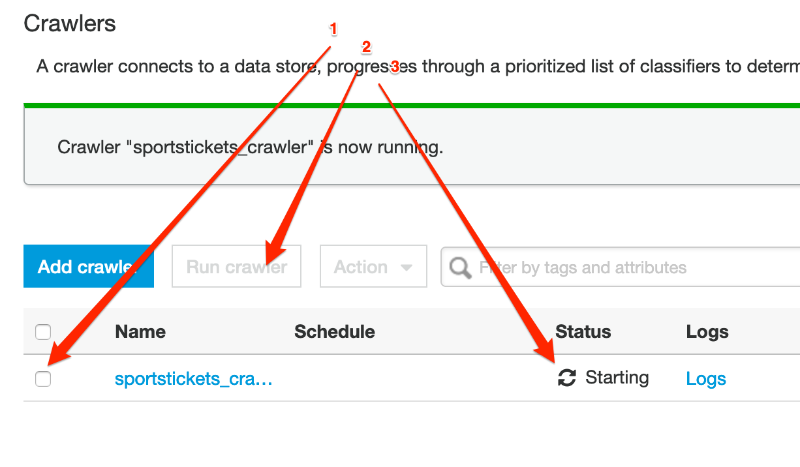

# Introduction
In this Lab we will create a schema from your data optimized for analytics and place the result in an S3 bucket
based data lake.

## Before you begin

Please make sure now you selected the region where your data resides.
All resources to be created **must** to be in the same region.

## Preparing your environment

Before you start, make sure your raw data files are saved in a separate bucket in a folder
called "raw". Each file should be a separate table. Each table file should be preferably in a
separate folder with the table name. An example would be as follows:

```python
<schema_name>/<table_name>/LOAD00000001.csv
<schema_name>/<table_name>/LOAD00000002.csv
...
<schema_name>/<table_name>/LOAD00000009.csv
<schema_name>/<table_name>/LOAD0000000A.csv
<schema_name>/<table_name>/LOAD0000000B.csv
...
<schema_name>/<table_name>/LOAD0000000F.csv
<schema_name>/<table_name>/LOAD00000010.csv
...
```

In this lab we will:<br>
1. Create IAM role needed for the rest of the labs.<br>
2. Configure a Glue crawler accessing the raw data.<br>
3. Transform the files into Apache Parquet format (https://parquet.apache.org/) using Glue jobs.

### Create needed IAM Role

#### Creating a Policy for Amazon S3 Bucket (Console) 

1.	Sign in to the IAM console at https://console.aws.amazon.com/iam/ with your user that has administrator permissions. 
2.	In the navigation pane, choose Policies. 
3.	In the content pane, choose Create policy. 
4.	Choose service as S3.
5.	Search for the following actions and mark them as checked:
a.	GetObject
b.	PutObject
c.	DeleteObject
d.	ListBucket
6.	In Resources section, click Add ARN for bucket and object resources, enter the name of your bucket, choose Any for all objects in the bucket or enter name of specific folder.
7.	When you are finished, choose Review policy
8.	Enter the name of policy as “BYOD-S3Policy”

#### Creating a Role for AWS Service Glue (Console) 

1.	Sign in to the AWS Management Console and open the IAM console at https://console.aws.amazon.com/iam/. 
2.	In the navigation pane of the IAM console, choose Roles, and then choose Create role. 
3.	For Select type of trusted entity, choose AWS service. 
4.	Choose Glue as the service that you want to allow to assume this role.
5.	Choose Next: Permissions. 
6.	Mark “AWSGlueServiceRole” policy as checked to attach to the role. 
7.	Mark “BYOD-S3Policy” policy as checked to attach to the role. 
8.	Choose Next: Tags. 
9.	(Optional) Add metadata to the role by attaching tags as key–value pairs. For more information about using tags in IAM, see Tagging IAM Users and Roles. 
10.	Choose Next: Review. 
11.	For Role name, enter “glue-processor-role”. 
12.	 (Optional) For Role description, type a description for the new role. 
13.	Review the role and then choose Create role. 

NOTE: “AWSGlueServiceRole” is an AWS Managed Policy to provide Glue with needed permissions to access S3 data. However, you still need to allow access to your specific S3 bucket for Glue by attaching “BYOD-S3Policy” created policy.

### Add a crawler

A crawler connects to a data store to determine the schema for your data, and then creates metadata
tables in the data catalog.

- start by navigating to the *Crawlers* menu on the navigation pane, then press
**Add crawler**.
- specify the name: {choose-name}-ds and press **Next**;
- choose *Data stores* as *Crawler source type* and press **Next**;
- Choose *S3* as data store. Add S3 path where your raw data resides
    and press **Next*;
- At this stage we don't add any other data source;
- Choose the *glue-processor-role* as IAM Role and proceed to the schedule;
- Leave the *Run on demand* option at the Frequency section and press **Next**;


- Click on the **Add database** button and specify {choose-name}_src as
    database name (this will be the name representing the source database in the
    data catalog). Press **Next** and **Finish**;



- select the newly created crawler and push the **Run crawler** button. It will
    take a few minutes until it populates the data catalog.
    
#### Schema Validation

- In the AWS Glue navigation pane, click Databases > Tables. (You can also click the database name (e.g., "ticketdata" to browse the tables.). 
- Within the Tables section of your database, click one table. Please note that each file you had under the bucket /raw is now a different table

You may notice that some tables have column headers such as col0,col1,col2,col3. In absence of headers or when the crawler cannot determine the header type, default column headers are specified. **If this is your case, please follow these steps to resolve**:

- Click Edit Schema on the top right side. 
- In the Edit Schema section, double-click col0 (column name) to open edit mode. Type a chosen name, e.g. “id” as the column name.
- Repeat the preceding step to change the remaining column names to match those shown in the following figure.

NOTE: If you have any "id" column as integer, please make sure type is set to "double".

- Click Save. 

### Transform the data to Parquet format

In the following section, we will create one job per each file to transform the data from csv, tsv, xls (typical input formats) to parquet.


We place this data under the folder named "*curated*" in the data lake.

- In the Glue Console select the **Jobs** section in the left navigation panel'
- Click on the *Add job* button;
- specify a name in the name field, than select the
    *"glue-processor-role"*;
- select the option "*A proposed script generated by AWS Glue*";
- Tick the checkbox for "*Job Metrics*", under **Monitoring Options** and hit **Next**;
- select one table of the generated tables from your crawler and click Next; (You will need to repeat this for each table)
- On the Choose a transformation type page, select change schema 
- On the Choose your data targets page, select  Create tables in your data target.
- For Data store, select Amazon S3.
- For Format, select Parquet.
- For Target path, create a folder with name "curated" in your bucket, create another
folder inside curated with the table name, and choose it as a location to store the
results e.g., "s3://{YOUR_DATA_LAKE_BUCKET}/curated/{TABLE_NAME}"
- Click Next.
- You can edit schema mapping to destination in this step. If you have an id column as integer type, please make sure it's changed to double by clicking Data type col.
- click Save and Run job.


Now repeat this last step per each file/ table you had originally.

So far, what we did is shown in the following diagram


**NOTE: You will be re-visiting this step at the end of the labs to edit generated script
and do partitioning for your data. This will show you how your Athena queries will perform
better after partitioning. Currently running jobs multiple times will result in duplicate files being
created in destination folders, which can give wrong results later with your queries. We will handle
this in the partitioning section later. In the mean time, make sure your destination folders are
empty each time if you want to run your jobs. We will run all jobs as a pipeline in the next lab.**
