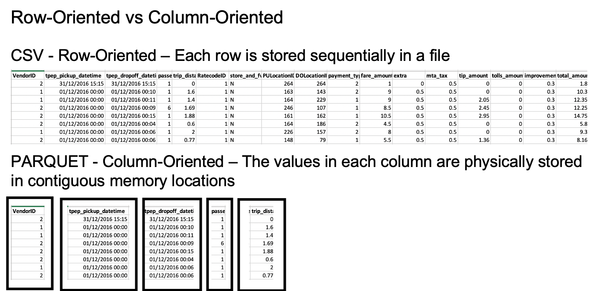

# Introduction

In this Lab we will create a schema from your data optimized for analytics and place the result in an S3 bucket based data lake.

## Before you begin

Please make sure now you selected the region where your data resides.
All resources to be created **must** be in the same region.

## Preparing your environment

Before you start, make sure your raw data files are saved in a separate bucket in a folder
called "raw". Each file should be a separate table. Each table file should be preferably in a
separate folder with the table name. An example would be as follows:

``` python
/raw/TABLE-NAME-1/LOAD00000001.csv
/raw/TABLE-NAME-1/LOAD00000002.csv
...
/raw/TABLE-NAME-2/LOAD00000001.csv
/raw/TABLE-NAME-2/LOAD00000002.csv
...
```

In this lab we will:

1. Create IAM roles needed for the rest of the labs.
2. Transform the files into Apache Parquet format (https://parquet.apache.org/) using Glue jobs.

### Configure Permissions

#### Creating a Policy for Amazon S3 Bucket (Console)

1. Sign in to the IAM console at https://console.aws.amazon.com/iam/ with your user that has administrator permissions.
2. In the navigation pane, choose Policies.
3. In the content pane, choose Create policy.
4. Choose JSON from the tabs.
5. Paste the following string in the text area. DO NOT FORGET TO PUT YOUR BUCKET NAME INSTEAD OF "YOUR-BUCKET-NAME"

``` json
{
    "Version": "2012-10-17",
    "Statement": [
        {
            "Sid": "s0",
            "Effect": "Allow",
            "Action": [
                "s3:PutObject",
                "s3:GetObject",
                "s3:ListBucket",
                "s3:DeleteObject"
            ],
            "Resource": [
                "arn:aws:s3:::YOUR-BUCKET-NAME",
                "arn:aws:s3:::YOUR-BUCKET-NAME/*"
            ]
        }
    ]
}
```

6. When you are finished, choose Review policy
7. Enter the name of policy as “BYOD-S3Policy”

#### Creating a Role for AWS Service Glue (Console)

1. Sign in to the AWS Management Console and open the IAM console at https://console.aws.amazon.com/iam/.
2. In the navigation pane of the IAM console, choose **Roles**, and then choose Create role.
3. For Select type of trusted entity, choose AWS service.
4. Choose **Glue** as the service that you want to allow to assume this role.
5. Choose Next: Permissions.
6. Mark “**AWSGlueServiceRole**” policy as checked to attach to the role.
7. Mark “**BYOD-S3Policy**” policy as checked to attach to the role.
8. Choose Next: Tags.
9. (Optional) Add metadata to the role by attaching tags as key–value pairs. For more information about using tags in IAM, see Tagging IAM Users and Roles.
10. Choose Next: Review.
11. For Role name, enter “**glue-processor-role**”.
12. Review the role and then choose **Create role**.

NOTE: “AWSGlueServiceRole” is an AWS Managed Policy to provide Glue with needed permissions to access S3 data. However, you still need to allow access to your specific S3 bucket for Glue by attaching “BYOD-S3Policy” created policy.

### Creating a Development Endpoint and Notebook (First Part)

1. On the left menu, click in Dev. enpoints and **Add endpoint**.
2. Development endpoint name: `byod`
3. IAM role: `byod`
4. Click **Next**
5. Select Skip networking information
6. Click **Next**
7. Click **Next** \- No need to Add SSH public key for Now
8. Click **Finish**

It will take a while to create the endpoint - we will be back to this step. Please continue.

## Transform the data to Parquet format

In the following section, we will create one job per each file to transform the data from csv, tsv, xls (typical input formats) to parquet.



We will place this data under the folder named "*curated*" in the data lake.

* In the Glue Console select the **Jobs** section in the left navigation panel'
* Click on the *Add job* button;
* specify a name (preferably **TABLE-NAME-1-job**) in the name field, then select the *"glue-processor-role"*;
* select the option "*A new script to be authored by you*";
* Provide a script name (preferably **TABLE-NAME-1-job-script.py**)
* Tick the checkbox for "*Job Metrics*", under **Monitoring Options** and hit **Next**;
* Under "Security configuration, script libraries, and job parameters (optional)", set **Maximum capacity** as 20. This determines the number of processing units to be used for the job. Higher numbers result in faster processing times but incur higher costs. This should be determined according to data size, data type etc. (further info can be found in [Glue documentation](https://docs.aws.amazon.com/glue/latest/dg/add-job.html).)
* click **Next**, then **Save job and edit script**. You will be redirected to script editor.
* Paste the following code to the editor. **DONT FORGET TO PUT IN YOUR INPUT AND OUTPUT FOLDER LOCATIONS.**

``` python
import sys
import datetime
from awsglue.transforms import *
from awsglue.utils import getResolvedOptions
from pyspark.context import SparkContext
from awsglue.context import GlueContext
from awsglue.job import Job
glueContext = GlueContext(SparkContext.getOrCreate())
job = Job(glueContext)

## DONT FORGET TO PUT IN YOUR INPUT AND OUTPUT FOLDER LOCATIONS BELOW.
input_location = "s3://YOUR-BUCKET-NAME/raw/YOUR-TABLE-NAME"
output_location = "s3://YOUR-BUCKET-NAME/curated/YOUR-TABLE-NAME"

job.init("byod-workshop" + str(datetime.datetime.now().timestamp()))

dynamicF = glueContext.create_dynamic_frame_from_options(
    connection_type="s3",
    format="csv",
    connection_options={
        "paths": [input_location]
    },
    format_options={
        "withHeader": True,
        "separator": ","
    })

glueContext.write_dynamic_frame.from_options(frame = dynamicF,
              connection_type = "s3",
              connection_options = {"path": output_location},
              format = "parquet")

job.commit()
```

* **Save**. Then **Run job**.


Now repeat this last step per each file / table you had originally.

## Add a crawler

Now that we have the data in Parquet format, we need to infer the schema.
Glue crawler connects to a data store to determine the schema for your data, and then creates metadata
tables in the data catalog.

* start by navigating to the *Crawlers* menu on the navigation pane, then press **Add crawler**.
* specify the name: {choose-name}-ds and press **Next**;
* choose *Data stores* as *Crawler source type* and press **Next**;
* Choose *S3* as data store. Add S3 path where your raw data resides and press \**Next*;
* At this stage we don't add any other data source;
* Choose the *glue-processor-role* as IAM Role and proceed to the schedule;
* Leave the *Run on demand* option at the Frequency section and press **Next**;
* Click on the **Add database** button and specify {choose-name}\_src as database name (this will be the name representing the source database in the data catalog). Press **Next** and **Finish**;


* select the newly created crawler and push the **Run crawler** button. It will take a few minutes until it populates the data catalog.

## Schema Validation

* In the AWS Glue navigation pane, click Databases > Tables. (You can also click the database name (e.g., "ticketdata" to browse the tables.).
* Within the Tables section of your database, click one table. Please note that each file you had under the bucket /raw is now a different table

You may notice that some tables have column headers such as col0,col1,col2,col3. In absence of headers or when the crawler cannot determine the header type, default column headers are specified. **If this is your case, please follow these steps to resolve**:

* Click Edit Schema on the top right side.
* In the Edit Schema section, double-click col0 (column name) to open edit mode. Type a chosen name, e.g. “id” as the column name.
* Repeat the preceding step to change the remaining column names to match those shown in the following figure.

NOTE: If you have any "id" column as integer, please make sure type is set to "double".

* Click Save.

### Creating a Development Endpoint and Notebook (Second Part)

1. Go to Notebooks, click Create notebook
2. Notebook name: aws-glue-`byod`
3. Attach to development: choose the endopoint created some steps back
4. Choose an existing IAM Role and choose the IAM role created some steps back.
5. **Create notebook**

**NOTE: You will be re-visiting this step at the end of the labs to edit generated script and do partitioning for your data. This will show you how your Athena queries will perform better after partitioning. Currently running jobs multiple times will result in duplicate files being created in destination folders, which can give wrong results later with your queries. We will handle this in the partitioning section later. In the mean time, make sure your destination folders are empty each time if you want to run your jobs. We will run all jobs as a pipeline in the next lab.**