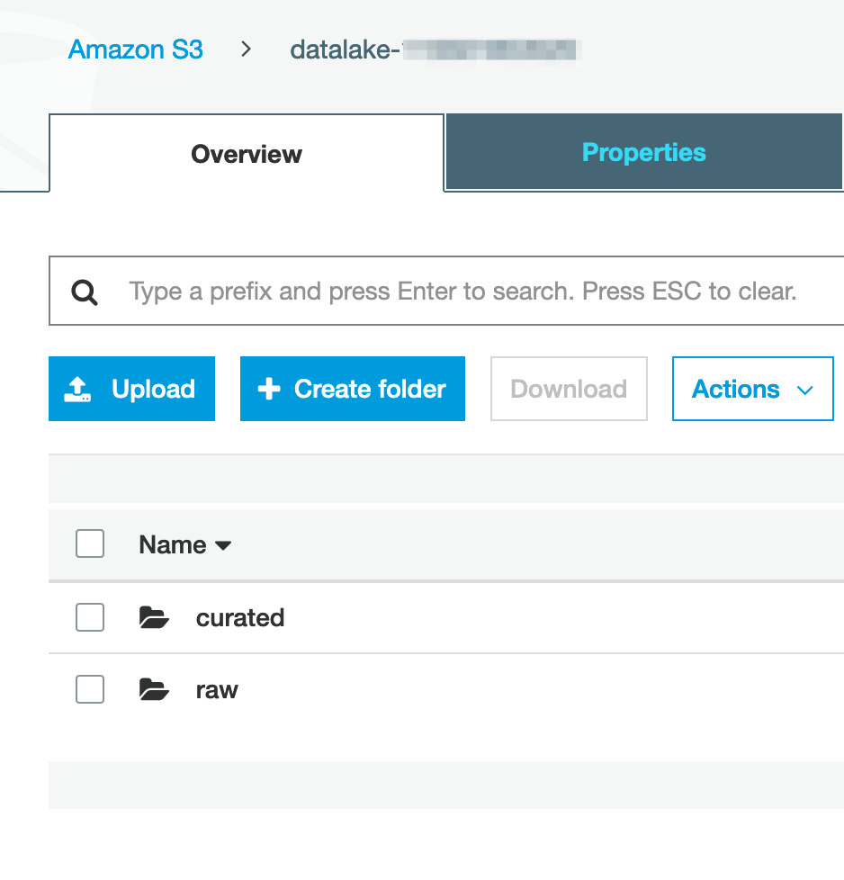
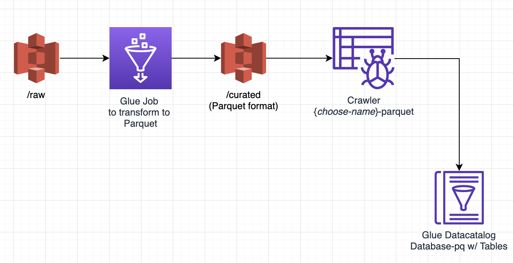
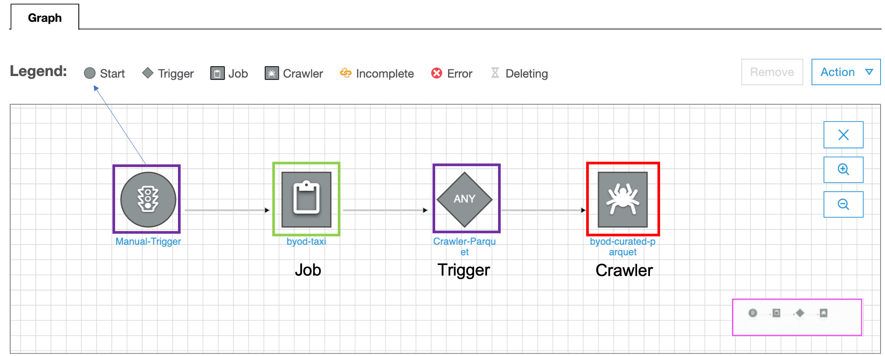
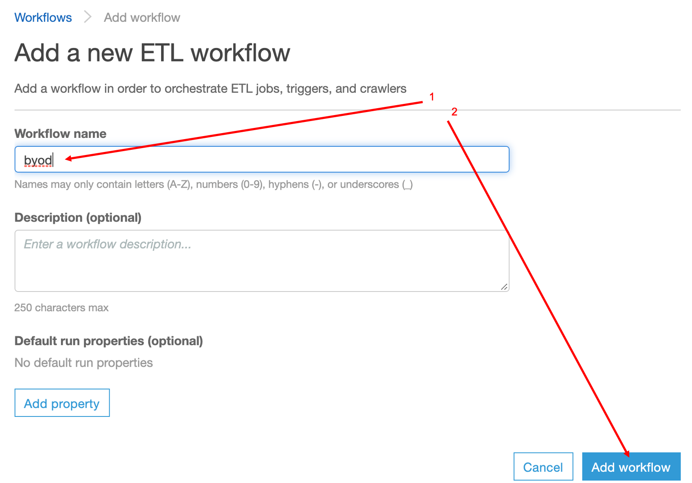
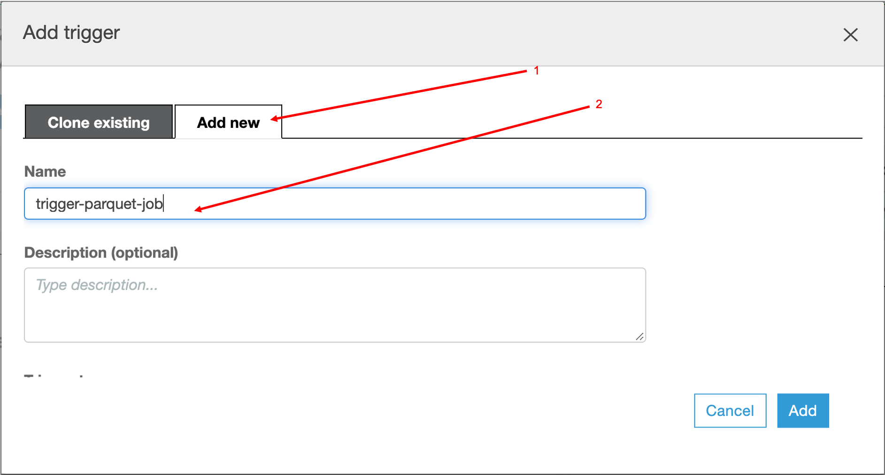
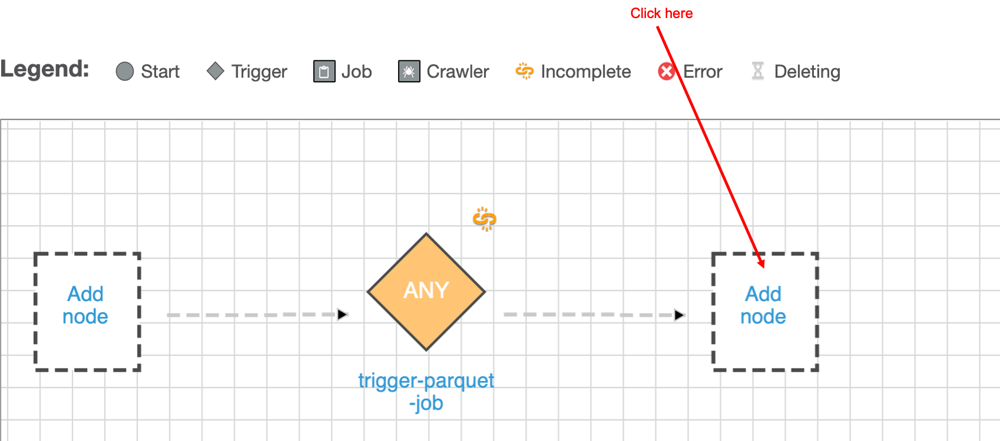
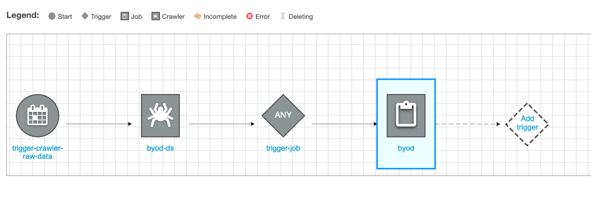
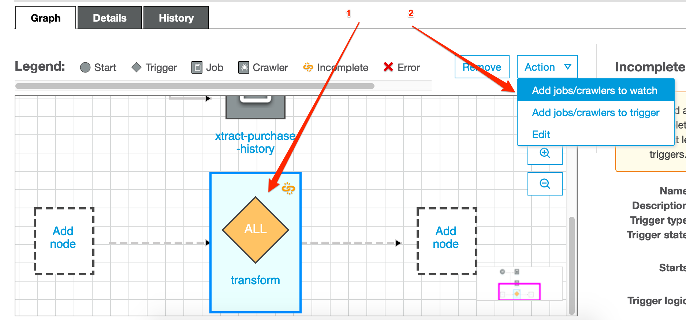
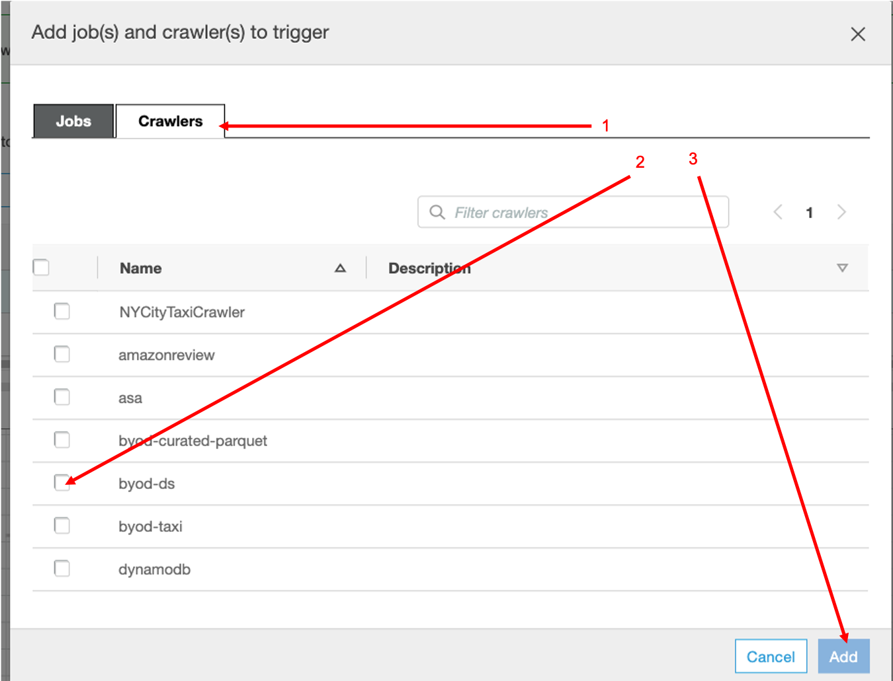
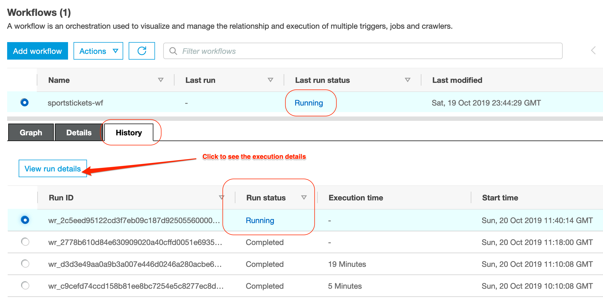

# Orchestrating the data pipline

In this lab we will continue to work with [Glue](https://aws.amazon.com/glue/) and convert the raw
data we have extracted in [the previous lab](../01_ingestion_with_glue/ingestion_with_glue.md) into a curated data set
by making some automation.

> **Please note**: this Lab depends on the steps executed in the [Transformation](../01_ingestion_with_glue/ingestion_with_glue.md) LAB;
> In case you didn't finish that one yet, now is the time :)

At this stage we have Glue Jobs configured to covert our raw data into Parquet.
We should be able to observe 2 main folders in our data-lake
bucket (raw and curated).

## Orchestrate the data pipeline using the Workflow feature

The plan is to create a pipeline, which will refresh the data-set every once in a while.

The next steps assume you need to perform some jobs before running the others. However, if your transformation jobs can run in parallel, feel free to add them in parallel in the pipeline.

An example of dependent jobs would be if you have jobs that extracts data from other source and ingest it into your data lake before kicking off another transformation jobs.

For this basic example we decided to automate the following steps:
- Transform to parquet
- Crawl Parquet/ curated data 

The first two steps were done in the previous part. The updated diagram of what we did plus the new crawler should look something like this

Now, lets automate this process so we dont have to worry about it....

Once we are done, it shoud look something like this

Let's get started - navigate to the *Workflows* in the *ETL* section on the left side-pane.

- we start by clicking on the **Add Workflow** button;
- add a name for our workflow (e.g. `byod`) and press the **Add Workflow** button;

Once the workflow is created add the first trigger to it.

1. Make sure you selected the *Add New* tab;
2. Define a *Name* for the new trigger (`trigger-parquet-job`);

Now, let's specify the *Frequency* before you press **Add** (let's say you run this workflow once a day);

Now, we need to configure the job that is going to be trigger. Click **Add Node**

Select the job that need to run first click **Add**.

<!--- Now we define the job to be triggered:

--->

<!------>

We are almost there, however there's one more thing: we need to add the crawler for the curated data - Please follow the same steps
1. Add a triger

2. Add a job to watched (In this case the transform job)

3. Add a job to be trigger (In this case the crawler-parquet)

### Reviewing the results

<!---If everything went according to the plan, we should see something similar to the
screenshot below (this is just an example):

--->

Once we are
ready, we can try out the workflow by clicking on **Run** in the **Actions**
menu.

> Once you selected a job, you can monitor it the execution status in the *History* TAB in the bottom
> panel;
> If the job(s) succeeded, visit the *Metrics* TAB to see resource utilisation
> and data movement information;
> Also note that the jobs can take quite a bit of time to end, about 15 minutes in total.

When jobs succeed you should find in your S3
bucket a folder called *curated* with subfolders for all your tables.

By selecting the latest Job and clicking on the **View run details** you can
monitor the execution results of the data processing pipeline:

Once the pipeline succeeded at least once, we should be able to observe the newly
created databases in the data catalog.

When you navigate to the **Tables** you will observe tables created from your data files.

<!------>

"What can I do with it?", you may wonder. Stay tuned, we will cover this in
great details in the next session.

