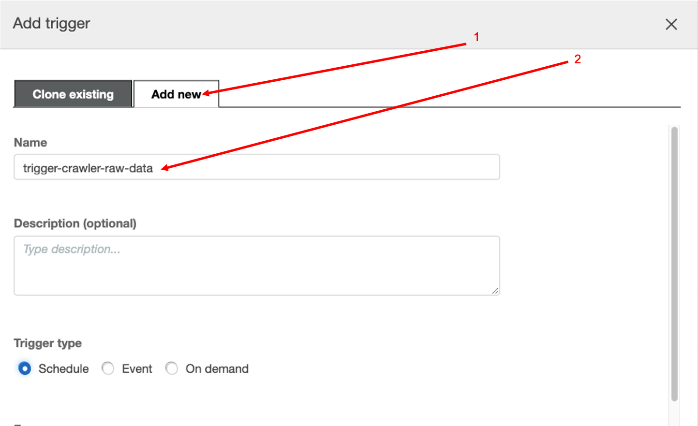
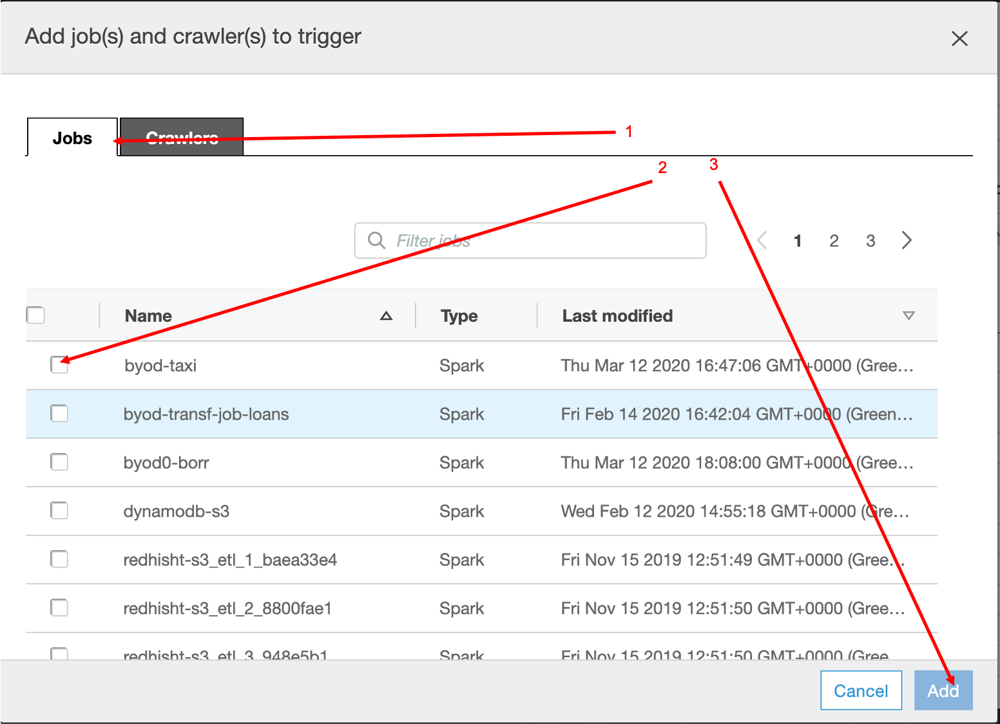
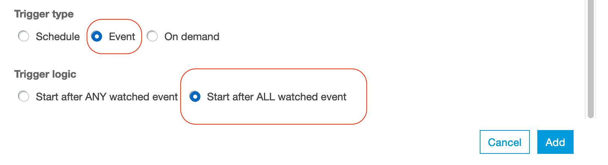
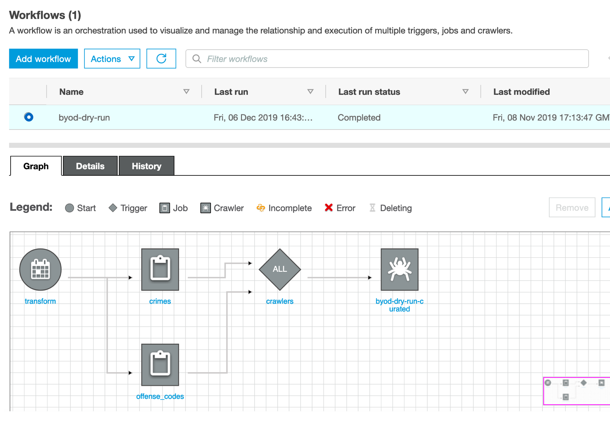

# Orchestrating the data pipline

In this lab we will continue to work with [Glue](https://aws.amazon.com/glue/) and convert the raw
data we have extracted in [the previous lab](../01_ingestion_with_glue/ingestion_with_glue.md) into a curated data set
by making some aggregation.

> **Please note**: this Lab depends on the steps executed in the [Transformation](../01_ingestion_with_glue/ingestion_with_glue.md) LAB;
> In case you didn't finish that one yet, now is the time :)

At this stage we have Glue Jobs configured to covert our raw data into Parquet.
We should be able to observe 2 main folders in our data-lake
bucket (raw and curated).

So far so good, however we'd probably like to automate this process and repeat it on a daily basis
for example.

## Orchestrate the data pipeline using the Workflow feature

The plan is to create a pipeline, which will
refresh the data-set every once in a while.
The next steps assume you need to perform some jobs before running the others. However, if your transformation jobs can run in parallel, feel free to add them in parallel in the pipeline.
An example of dependent jobs would be if you have jobs that extracts data from other source and ingest it into your data lake before kicking off another transformation jobs.

Let's navigate to the *Workflows* in the *ETL* section on the left side-pane.

- we start by clicking on the **Add Workflow** button;
- add a name for our workflow (e.g. `sportstickets-wf`) and press the **Add Workflow** button;

Once the workflow is created add the first trigger to it.

- make sure you selected the *Add New* tab;
- define a *Name* for the new trigger (`transform-data`);
- specify the *Frequency* before you press **Add** (let's say you run this
    workflow at the 30th minute of every hour);

<!------>

Start by clicking on the newly created trigger, then add the needed jobs
to it (that will run in parallel).

###Adding dependent jobs (Optional)

Next we add one more trigger to start the aggregation as soon the ingestion is
finished. Let's start by clicking on the **Add trigger** option in the top right
corner of the workflow editor.

<!------>

Make sure that you select the *Add new* tab and **Event** as a *Trigger type*. Let's call our trigger `transform`.
Don't save it just yet:

Scroll down and select the *"Start after ALL watched event"* option at the
*Trigger Logic*. This will make sure that we will only trigger the aggregation
job, once all the ingestion jobs are finished.

Now we have a trigger, we just need 2 more steps:

- add the dependency jobs (the ones to be watched)
- add the job which needs to be triggered once all watched ones are completed;

Select the jobs that need to run first, make sure that we're watching for the
**SUCCEEDED** event and push **Add**.

<!--- Now we define the job to be triggered:

--->

<!------>

We are almost there, however there's one more thing: the data we just generated
is not available in the data catalog for wider audiences.
Let's configure a one more crawler for our curated data and add it to the workflow.

## Register the staged data tables in the data catalog

Navigate to the **Crawlers** section in the left pane and press **Add crawler**.

- at the name specify: *{choose-name}_curated*;
- at the source types leave the default *Data stores* option;
- in the data-store section leave the default *S3* and the *Specified path in my account*.
- now select your curated folder: *s3://datalake-xxxxyyyyzzzzz/curated*
- at the *Choose an IAM role* section choose the *glue-processor-role* and hit
    **Next**;
- frequency stays **On demand**;
- and finally we add a new database called *{choose-name}_curated*

We return to the *Workflows* in the left side pane, select our created workflow and add one more trigger from the `Action` menu on the right.

- Select the **Add new** tab;
- Define the name as "*crawlers*";
- Choose *Event* as *Trigger type*;
- Select "*Start after ALL watched event*" and click **Add**;
- Now select the newly created trigger in the workflow editor and click on the
**Add jobs/crawlers to watch**. Select your jobs and hit **Add**.
- Select the **Add jobs/crawlers to trigger** option;
- This time select the **Crawlers** tab and check your curated
    crawler.
   

### Reviewing the results

<!---If everything went according to the plan, we should see something similar to the
screenshot below (this is just an example):

--->

**NOTE:** In your created workflow, it starts by executing the jobs. However, because there is always
new data being added or updated in your raw folder, you should later add your created crawler
in the very beginning as the trigger to your transformation jobs.

Once we are
ready, we can try out the workflow by clicking on **Run** in the **Actions**
menu.

> Once you selected a job, you can monitor it the execution status in the *History* TAB in the bottom
> panel;
> If the job(s) succeeded, visit the *Metrics* TAB to see resource utilisation
> and data movement information;
> Also note that the jobs can take quite a bit of time to end, about 15 minutes in total.

When jobs succeed you should find in your S3
bucket a folder called *curated* with subfolders for all your tables.

By selecting the latest Job and clicking on the **View run details** you can
monitor the execution results of the data processing pipeline:

Once the pipeline succeeded at least once, we should be able to observe the newly
created databases in the data catalog.

When you navigate to the **Tables** you will observe tables created from your data files.

<!------>

"What can I do with it?", you may wonder. Stay tuned, we will cover this in
great details in the next session.
