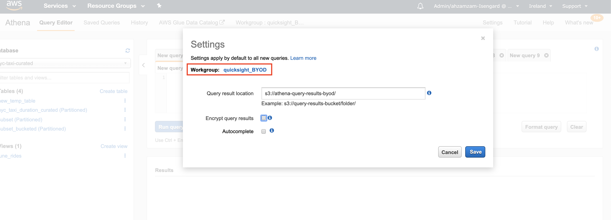

# Lab 3: Interactive SQL Queries Using Amazon Athena

  
 *  [Setting up Workgroups](#setting-up-workgroups)
 *  [Setting up Amazon S3 and Athena for Storing Query Results](#setting-up-amazon-s3-and-athena-for-storing-query-results)
	 * [Creating an Amazon S3 Bucket](#creating-an-amazon-s3-bucket)
	 * [Setting up Amazon Athena](#setting-up-amazon-athena)
 *  [(Optional) Creating Amazon Athena Database and Table](#creating-amazon-athena-database-and-table)
	 *  [Create Athena Database](#create-database)
	 *  [Create Athena Table](#create-a-table)
 * [(Optional) Amazon Athena Best Practices](#amazon-athena-best-practices)
	 * [Using Columnar Storage](#using-columnar-storage)
	 * [Partitioning your Data](#partitioning-your-data)
 * [Using 'CREATE TABLE AS SELECT'](#using-create-table-as-select)
 * [Detecting New Partitions](#detecting-new-partitions)
 * [Joining Tables](#joining-tables)
 * [(Optional) Creating Views](#creating-views)
  

## Architectural Diagram


## Setting up Workgroups

Workgroups are used to isolate queries for teams, applications, or different workloads. Workgroups offer some benefits such as:

 - Enforcing cost constraints - you can apply a limit for each workgroup or you can limit the data scanned by each query.
 - Track query-related metrics for all workgroup queries in CloudWatch.

You may create separate workgroups for different teams in your organisation. In this lab, we will create a workgroup for our Quicksight Users

 1. Open the [AWS Management Console for Athena](https://console.aws.amazon.com/athena/home).

 2. Make sure you are in the same region as the previous labs. 

 3. If this is your first time visiting the AWS Management Console for Athena, you will get a Getting Started page. Choose **Get Started** to open the Query Editor. 

 4. Click on **Workgroup:Primary**. In the Workgroup page, click on **Create workgroup**
 

 5. In the new page, enter the **Workgroup name**, **Description** and click on **Create workgroup**.
 

 6. In the Workgroup page, select the newly created workgroup and click on **Switch workgroup**. 
  

 7. In the top bar, make sure you are currently on the new workgroup.
   

## Setting up Amazon S3 and Athena for Storing Query Results

If you’re a first time Athena user, you will have to configure an S3 bucket, where Athena will store the query results.

### Creating an Amazon S3 Bucket 

> Note: If you have already have an S3 bucket in your AWS Account and can be used to store Athena Query results, you can skip this section.

1. Open the [AWS Management console for Amazon S3](https://s3.console.aws.amazon.com/s3/home?region=eu-west-1)

2. On the S3 Dashboard, Click on **Create Bucket**.

  


  

3. In the **Create Bucket** pop-up page, input a unique **Bucket name**. It is advised to choose a large bucket name, with many random characters and numbers (no spaces).

  

1. Select the region and make sure you are using the same region used throughout the lab.

2. Click **Next** to navigate to next tab.

3. In the **Set properties** tab, leave all options as default.

4. In the **Set permissions** tag, leave all options as default.

5. In the **Review** tab, click on **Create Bucket**


### Setting up Amazon Athena

You can use an already existing bucket with a dedicated folder or you can create a new, dedicated bucket.

 1. Navigate to Athena console
 
 2. Make sure you are on the right workgroup and click on **Settings** on the top bar

 3. Fill in the required information and click **Save**



<b>NOTE:</b> Make sure you have forward slash at the end of the S3 path

## Creating Amazon Athena Database and Table
**[OPTIONAL]**
  

> Note: If you have complete the [Lab 1: Ingestion with Glue](../01_ingestion_with_glue) you can skip this section and go to the next section [(Optional) Amazon Athena Best Practices](#amazon-athena-best-practices)

  

Amazon Athena uses Apache Hive to define tables and create databases. Databases are a logical grouping of tables. When you create a database and table in Athena, you are simply describing the schema and location of the table data in Amazon S3\. In case of Hive, databases and tables don’t store the data along with the schema definition unlike traditional relational database systems. The data is read from Amazon S3 only when you query the table. The other benefit of using Hive is that the metastore found in Hive can be used in many other big data applications such as Spark, Hadoop, and Presto. With Athena catalog, you can now have Hive-compatible metastore in the cloud without the need for provisioning a Hadoop cluster or RDS instance. For guidance on databases and tables creation refer [Apache Hive documentation](https://cwiki.apache.org/confluence/display/Hive/LanguageManual+DDL). The following steps provides guidance specifically for Amazon Athena.

### Create a Database

  

1. Open the [AWS Management Console for Athena](https://console.aws.amazon.com/athena/home).
2. Make a note of the AWS region name.

3. In the Athena **Query Editor**, you will see a query pane with an example query. Now you can start entering your query in the query pane.

4. To create a database named *mydatabase*, copy the following statement, and then choose **Run Query**:

  

````sql

CREATE  DATABASE  mydatabase

````

  

6. Ensure *mydatabase* appears in the DATABASE list on the **Catalog** dashboard


  

### Create a Table

  

1. Ensure that you are on the same AWS Region

  

2. Ensure **mydatabase** is selected from the DATABASE list and then choose **New Query**.

  

3. In the query pane, copy the following statement to create a the NYTaxiRides table, and then choose **Run Query**:

  

````sql

CREATE  EXTERNAL  TABLE NYTaxiRides (

vendorid STRING,

pickup_datetime TIMESTAMP,

dropoff_datetime TIMESTAMP,

ratecode INT,

passenger_count INT,

trip_distance DOUBLE,

fare_amount DOUBLE,

total_amount DOUBLE,

payment_type INT

)

PARTITIONED BY (YEAR  INT, MONTH  INT, TYPE string)

STORED AS  PARQUET

LOCATION  's3://us-west-2.serverless-analytics/canonical/NY-Pub'

````

  

4.Ensure the table you just created appears on the Catalog dashboard for the selected database.

  

Now that you have created the table you need to add the partition metadata to the Amazon Athena Catalog.

  

1. Choose **New Query**, copy the following statement into the query pane, and then choose **Run Query** to add partition metadata.

  

```sql

MSCK REPAIR TABLE NYTaxiRides

```

The returned result will contain information for the partitions that are added to NYTaxiRides for each taxi type (yellow, green, fhv) for every month for the year from 2009 to 2016


## Amazon Athena Best Practices
**[OPTIONAL]**
 
 In the first Lab we did two transformations to the data; *changed the format to parquet* and *partitioned the data*. This section discusses why columnar storage and partitioning are common best practices that enable you to get the most out of Athena. 

Before doing this let's discuss how Athena [pricing](https://aws.amazon.com/athena/pricing/) works. With Athena, you are charged for the number of bytes scanned by Amazon Athena, rounded up to the nearest megabyte, with a 10MB minimum per query. Thus, the aim is to run the query with least amount of data scanned.

We will run the same query before and after we do the optimisation to see how both significantly reduce the amount of data scanned 
  
### Using Columnar Storage
Apache Parquet is a popular columnar storage format that is optimised for fast retrieval of data and used in AWS analytical applications. Parquet and other popular columnar storage formats have *three* main benefits that make them suitable for using with Athena; 

 - *Compression by column*, and thus, better compression rate and lower storage cost.
 - *Predicate pushdown* enables Athena queries to fetch only the blocks it needs, improving query performance. When an Athena query obtains specific column values from your data, it uses statistics from data block predicates, such as max/min values, to determine whether to read or skip the block.
 - *Splitting of data* allows Athena to split the reading of data to multiple readers and increase parallelism during its query processing.

Now let's compare the amount of data scanned when we run the same query on the raw and curated tables

 1.  Open the [AWS Management Console for Athena](https://console.aws.amazon.com/athena/home) and make sure you are on the same AWS Region.
 2. Choose the *{raw database}* from the dropdown menu and execute the following query:

```sql

SELECT * FROM {raw_table_name}

```

 3. Wait the query to execute and note the amount of **Data scanned** by the query. 
 
 
 4. Let's run the same query on the optimised data to compare the difference. Choose the *{curated database}* from the dropdown menu and execute the same query with the new {curated_table_name}.
 5. Wait for the query to execute the note the amount of **Data Scanned**
 

You noticed in this lab by converting to Columnar storage format, you significantly reduced the amount of data scanned, and thus, reducing Athena costs and improving performance.

### Partitioning your Data

By partitioning your data, you can restrict the amount of data scanned by each query, thus improving performance and reducing cost. Athena leverages Hive for partitioning data. You can partition your data by any key. A common practice is to partition the data based on time, often leading to a multi-level partitioning scheme.

To see the benefit of partitioning, let's run the same query on the raw (non partitioned) and curated (partitioned). This time the query should filter the results using the *WHERE* clause in the SQL statement. The aim is use the column used to partition the data to filter the results.

1.  Open the [AWS Management Console for Athena](https://console.aws.amazon.com/athena/home) and make sure you are on the same AWS Region.
 2. Choose the *{raw database}* from the dropdown menu and execute the following query:

```sql

SELECT count(*) AS FilterCount 
from {raw_table_name} 
where {condition_on_partitioned_column}

```

 3. Wait the query to execute and note the amount of **Data scanned** by the query. 
 
 
 4. Let's run the same query on the optimised data to compare the difference. Choose the *{curated database}* from the dropdown menu and execute the same query with the new {table_name_curated}.
 5. Wait for the query to execute the note the amount of **Data Scanned**
 

You learnt in this lab that if you have many queries that are filtered in the WHERE clause, then the column used to filter the query result would be a good partitioning candidate. By partitioning your data you will  significantly reduce the amount of data scanned, and thus, reducing Athena costs and improving performance. 


## Using 'CREATE TABLE AS SELECT'

**[OPTIONAL]**

A `CREATE TABLE AS SELECT` (CTAS) query creates a new table in Athena from the results of a `SELECT` statement from another query. Athena stores data files created by the CTAS statement in a specified location in Amazon S3.

Use CTAS queries to:

-   Create tables from query results in one step, without repeatedly querying raw data sets. This is useful if you want to create a new table from the results of joining two tables.
-   Transform query results into other storage formats, such as Parquet and ORC. This improves query performance and reduces query costs in Athena.
-   Create copies of existing tables that contain only the data (subset of the table) you need.
- Bucketing your data, which another common technique to improve Athena performance and cost. For more information, see [Bucketing vs Partitioning](https://docs.aws.amazon.com/athena/latest/ug/bucketing-vs-partitioning.html)

In this lab we will show you how to create a subset table from the original table with partitioning enabled. We will also create the same subset but with partitioning and bucketing enabled. We will then execute the same query on both subset tables and  and compare the results.

> Note: This lab will run on the Curated Table


### Using CTAS to create First subset - partitioned
 1. Open the [AWS Management Console for Athena](https://console.aws.amazon.com/athena/home) and make sure you are on the same AWS Region.
 2. Choose the *{curated database}* from the dropdown menu and execute the following query:
 ```sql

CREATE TABLE subset 
WITH (
      format = 'PARQUET', 
      external_location = 's3://{athena-s3-bucket}/{first_subset}/', 
      partitioned_by = ARRAY['{col1}','{col2}', etc ...], 
) 
AS SELECT * 
FROM {curated_table_name}
where {CTAS_condition}

```


 3. Navigate to S3 and check the newly created files
 

### Using CTAS to create Second subset - partitioned and bucketed
 

 1. Choose the *{curated database}* from the dropdown menu and execute the following query:
 ```sql
 CREATE TABLE subset_bucketed 
WITH (
      format = 'PARQUET', 
      external_location = 's3://{athena-s3-bucket}/{first_subset}/', 
      partitioned_by = ARRAY['{col1}','{col2}',etc..], 
      bucketed_by = ARRAY['{primary_key}'], 
      bucket_count = 5) 
AS SELECT * 
FROM {curated_table_name}
WHERE {CTAS_condition}

```


 2. Navigate to S3 and check the newly created files. Notice that data within one partition is bucketed into *5 (configured in the CTAS query)* different files
 
 
### Comparing Results
 
 > Note: **{primary_key}** here should be the column used for ***bucketing***. Columns with high cardinality (high number or unique values) that are spread evenly are good candidates for *bucketing*.

 1. In Athena Console, execute the following query on the new table (subset)
   ```sql
AS SELECT * 
FROM subset
WHERE {primary_key} = {value} 

```

 2. Wait for the query to finish and note the amount of **data scanned** by the query.
  

 3. In the **Query Editor**, execute the following query on the new table (subset_bucketed)
   ```sql
AS SELECT * 
FROM subset_bucketed
WHERE {primary_key} = {value} 

```

 4. Wait for the query to finish and note the amount of **data scanned** by the query.
  

In this lab we learnt that bucketing is also a very useful optimisation. Columns with high cardinality (high number of unique values) that are evenly spread are good candidates for bucketing. Bucketing distribute the data to different files within a partition. So if we want to filter a partition, Athena will only scan the relevant bucket files not the whole partition.


## Detecting New Partitions
**[OPTIONAL]**

> Note: This lab will run on the Curated dataset and table
> 
If a new partition is added, the **Data Catalog** used by Athena should be updated to recognise the new partition. A common way to detect newly added partitions is to run the Glue Crawler once a new partition is added. In Lab 2 we went through how to orchestrate your jobs and crawlers to run periodically or with on-demand triggers. Another approach is to use [MSCK RERAIR TABLE](https://docs.aws.amazon.com/athena/latest/ug/msck-repair-table.html) command to automatically add the partitions to the catalog. This command if the partitioning structure conforms to Hive structure *(s3://dataset/{col1=value}/{col2=value})*. If the portioning structure does not conform to Hive *(for example: s3://dataset/2019/Jan and s3://dataset/2018/Feb)*, then you might have to run the Crawler or manually add the partitions by using ALTER TABLE in Athena

In this section we will manually create a new partition in S3. Check if Athena recognises the partition, load all partitions and check again.


 1. Open the [AWS Management console for Amazon S3](https://s3.console.aws.amazon.com/s3/home?region=eu-west-1)
 
 2. Navigate into your **curated dataset** folder and add a new folder (partition) by clicking on **Create Folder**. We will not need to add data to the partition
  
  
 3. If you do not have sub-partitions (for example; year only) proceed to the next step. 
If your table has sub-partitions (for example; partition by year and month), create a new empty folder inside your new partition. The end result should be something like this; s3://{bucket_name}/{curated_dataset}/{col1=value}/{col2=value}

 4. Let's see if Athena can recognise the new partitions. Go to Athena Console, in the **Query Editor** pane type the following SQL
   ```sql
 SHOW PARTITIONS {curated_table_name}

```

 5. Wait for the query to finish and check the results. You will notice that you will not find the newly created partition.
   
   
 6. In the **Query Editor** pane execute the following SQL command

  ```sql
 MSCK REAPAIR TABLE {curated_table_name}

```


 7. Wait for the query to finish and check the results.
   
   
 8. Run the ```SHOW PARTITIONS {curated_table_name}``` query again and wait for the query to finish. You will notice in the results that Athena now recogises the new partitions.
   


 ## Joining Tables
 
This section shows how to join two tables together. If you are familiar with SQL JOINs please proceed to the [next section](#creating-views).

### Create a new Table
> Note: If you already have *two* tables that could be joined together skip this step and proceed to [next sub-section](#sql-joins)
> 
Before joining *two* tables, let's create a new table (with mocked data) with a foreign key relationship with our *{curated_table_name}*

 1. Open the [AWS Management Console for Athena](https://console.aws.amazon.com/athena/home) and make sure you are on the same AWS Region.
 2. Choose the *{curated database}* from the dropdown menu and execute the following query:
 ```sql
 CREATE  EXTERNAL  TABLE {mocked_table_nale} (

vendorid BIGINT,

vendor_name STRING,

CAR_COUNT BIGINT

)

STORED AS  PARQUET

LOCATION  ''s3://{athena-s3-bucket}/{mocked_table}/''

```

 3. Now let's insert some mocked data to the new table. The data should have foreign key relationship with the original table.
 ```sql
INSERT  INTO  {mocked_table_name} ({column1},{column2}, {column3}, ...)  
VALUES ({value1.1}, {value2.1}, {value3.1}, ...),
({value1.2}, {value2.2}, {value3.2}, ...),
({value1.3}, {value2.3}, {value3.3}, ...);
```

   

 4. Make sure the data is inserted by executing  ```SELECT * FROM {mocked_table_name}```

### SQL Joins

Here are the different types of the JOINs in SQL:

-   **(INNER) JOIN**: Returns records that have matching values in both tables
-   **LEFT (OUTER) JOIN**: Returns all records from the left table, and the matched records from the right table
-   **RIGHT (OUTER) JOIN**: Returns all records from the right table, and the matched records from the left table
-   **FULL (OUTER) JOIN**: Returns all records when there is a match in either left or right table

In this lab we will explore different types of JOINs:

 

 1. *Inner Join*:- Run the following query in the **Query Editor**
 ```sql
SELECT {mocked_table}.{column_name}, count(*) AS Total
FROM {mocked_table}
INNER JOIN {original_table} ON {original_table}.{forgein_key}={mocked_table}.{forgeinkey}
GROUP BY {mocked_table}.{vendor_name}
```
   
   
	 In the above example because vendor2 is not in the {mocked_table} and vendor3 is not the {original_table}, both were excluded when doing ```INNER JOINS```
 
 2. *Left Join*:- If you use the same query but replace ```INNER``` with ```LEFT```. We will see results that either matched with the right table or entries from the left table
 ```sql
SELECT {mocked_table}.{column_name}, count(*) AS Total
FROM {mocked_table}
LEFT JOIN {original_table} ON {original_table}.{forgein_key}={mocked_table}.{forgeinkey}
GROUP BY {mocked_table}.{vendor_name}
```
   
   
	  In the above example because vendor2 is not in the Left Table ({mocked_table}) it's excluded from the results. All other records in the Left Table are are included.

 
 3. *Right Join*:- This is the same as the above but it applies on the Right table {original_table}. We will see results that either matched with the left table or entries from the right table
  ```sql
SELECT {mocked_table}.{column_name}, count(*) AS Total
FROM {mocked_table}
LEFT JOIN {original_table} ON {original_table}.{forgein_key}={mocked_table}.{forgeinkey}
GROUP BY {mocked_table}.{vendor_name}
```
   

	In the above example because vendor3 is not in the right Table ({original_table}) it's excluded from the results. All other records in the right Table are included. And because vendor2 is not in the left table {mocked_table}, is does not have a name and thus empty field

 4. *Full Join*:- All records are returned
  ```sql
SELECT {mocked_table}.{column_name}, count(*) AS Total
FROM {mocked_table}
FULL JOIN {original_table} ON {original_table}.{forgein_key}={mocked_table}.{forgeinkey}
GROUP BY {mocked_table}.{vendor_name}
```
   
 
 ## Creating Views
**[OPTIONAL]**

A view in Amazon Athena is a logical, not a physical table. The query that defines a view runs each time the view is referenced in a query. In this section, we walk through how to create a view:

 1. Open the [AWS Management Console for Athena](https://console.aws.amazon.com/athena/home) and make sure you are on the same AWS Region.
 
 2. Choose the *{curated database}* from the dropdown menu and execute the following query:
  ```sql
CREATE VIEW {view_name} AS  {your_query}
```

 3. Wait for the query to execute. After it finishes you can see the newly created view under **Views** on the right pane.


 4. To query a view, run the following:
   ```sql
SELECT * FROM {view_name}
```
 5. To update a view, run the following
   ```sql
CREATE [ OR  REPLACE ] VIEW {view_name} AS {your_query}
```
