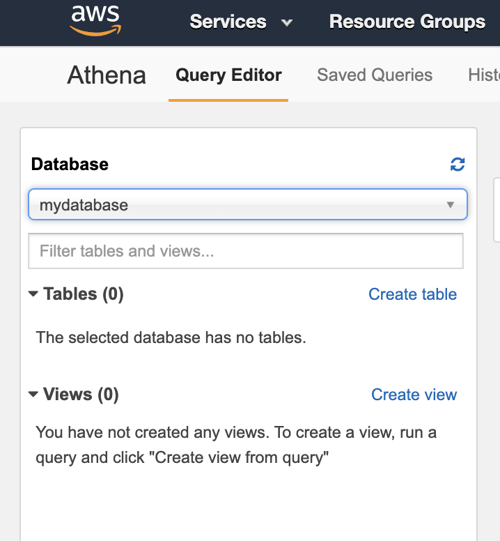
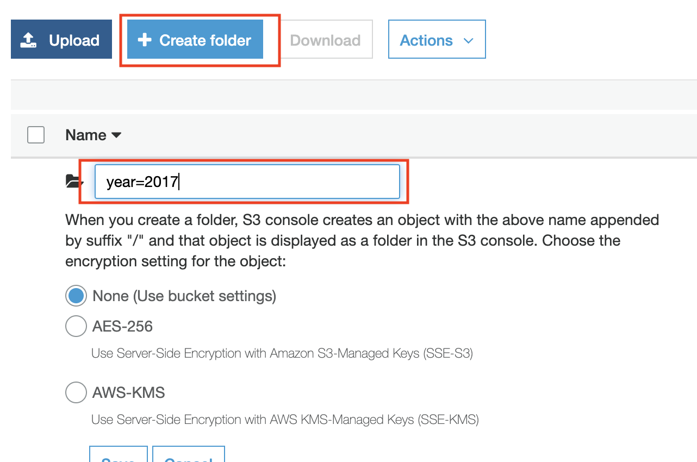
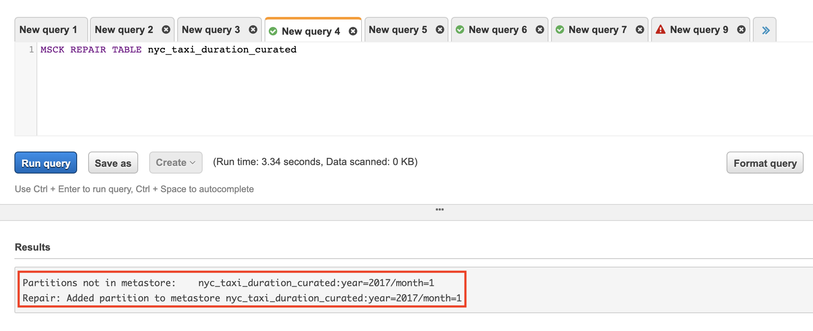
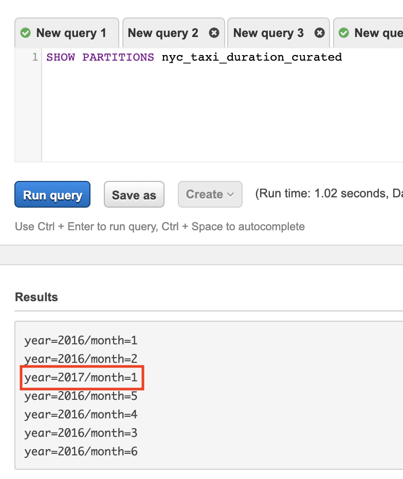

# Lab 3: Interactive SQL - Optional Labs

 * [Introduction](#introduction)
 * [Creating Amazon Athena Database and Table](#creating-amazon-athena-database-and-table)
 * [Detecting New Partitions](#detecting-new-partitions)

## Introduction

These are optional labs:

 - [Creating Amazon Athena Database and Table](#creating-amazon-athena-database-and-table): Should be completed if you want Athena to create the database and table and not Glue Crawlers
 - [Detecting New Partitions](#detecting-new-partitions): Should be completed if you manually added a partition that conforms with Hive format, and do not want want to use Glue crawlers to add the partitions to the table.

## Creating Amazon Athena Database and Table
  

> Note: If you  completed the [Lab 1: Ingestion with Glue](../01_ingestion_with_glue/README.md) you can skip this section and go back to [Start Exploring with Athena](./main.md/#start-exploring-with-athena)

One other method to populate the Data Catalog is using Amazon Athena. If you have a simple dataset and you already know the schema, you can manually populate the Data Catalog using SQL DDL statements. You enter these SQL DDL statements in Athena Console and Athena will execute them **free of charge**

 Athena uses Apache Hive to define tables and create databases. Databases are a logical grouping of tables. When you create a database and table in Athena, you are simply describing the schema and location of the table data in Amazon S3\. In case of Hive, databases and tables don’t store the data along with the schema definition unlike traditional relational database systems. The data is read from Amazon S3 only when you query the table. The other benefit of using Hive is that the metastore found in Hive can be used in many other big data applications such as Spark, Hadoop, and Presto. With Athena catalog, you can now have Hive-compatible metastore in the cloud without the need for provisioning a Hadoop cluster or RDS instance. For guidance on databases and tables creation refer [Apache Hive documentation](https://cwiki.apache.org/confluence/display/Hive/LanguageManual+DDL). The following steps provides guidance specifically for Amazon Athena.

### Create a Database

  

1. Open the [AWS Management Console for Athena](https://console.aws.amazon.com/athena/home).
2. Make a note of the AWS region name.

3. In the Athena **Query Editor**, you will see a query pane with an example query. Now you can start entering your query in the query pane.

4. To create a database named *mydatabase*, copy the following statement, and then choose **Run Query**:

  

````sql

CREATE  DATABASE  mydatabase

````

  

5. Ensure *mydatabase* appears in the DATABASE list on the **Catalog** dashboard


  

### Create a Table

  

1. Ensure that you are on the same AWS Region

  

2. Ensure **mydatabase** is selected from the DATABASE list and then choose **New Query**.

  

3. In the query pane, copy the following statement to create a the NYTaxiRides table, and then choose **Run Query**:

  

````sql

CREATE  EXTERNAL  TABLE NYTaxiRides (

vendorid STRING,

pickup_datetime TIMESTAMP,

dropoff_datetime TIMESTAMP,

ratecode INT,

passenger_count INT,

trip_distance DOUBLE,

fare_amount DOUBLE,

total_amount DOUBLE,

payment_type INT

)

PARTITIONED BY (YEAR  INT, MONTH  INT, TYPE string)

STORED AS  PARQUET

LOCATION  's3://us-west-2.serverless-analytics/canonical/NY-Pub'

````

  

4. Ensure the table you just created appears on the Catalog dashboard for the selected database.

  
#### Adding Partition Meta-data
Now that you have created the table you need to add the partition metadata to the Amazon Athena Catalog.

  

1. Choose **New Query**, copy the following statement into the query pane, and then choose **Run Query** to add partition metadata.

  

```sql

MSCK REPAIR TABLE NYTaxiRides

```

The returned result will contain information for the partitions that are added to NYTaxiRides for each taxi type (yellow, green, fhv) for every month for the year from 2009 to 2016

## Detecting New Partitions
**[OPTIONAL]**

> Note: This lab will run on the Curated dataset and table
> 
If a new partition is added, the **Data Catalog** used by Athena should be updated to recognise the new partition. A common way to detect newly added partitions is to run the Glue Crawler once a new partition is added. In Lab 2 we went through how to orchestrate your jobs and crawlers to run periodically or with on-demand triggers. 
Another approach is to use [MSCK RERAIR TABLE](https://docs.aws.amazon.com/athena/latest/ug/msck-repair-table.html) command to automatically add the partitions to the catalog. This command if the partitioning structure conforms to Hive structure *(s3://dataset/{col1=value}/{col2=value})*. If the portioning structure does not conform to Hive *(for example: s3://dataset/2019/Jan and s3://dataset/2018/Feb)*, then you might have to run the Crawler or manually add the partitions by using ALTER TABLE in Athena

In this section we will manually create a new partition in S3. Check if Athena recognises the partition, load all partitions and check again.


 1. Open the [AWS Management console for Amazon S3](https://s3.console.aws.amazon.com/s3/home?region=eu-west-1)
 
 2. Navigate into your **curated dataset** folder and add a new folder (partition) by clicking on **Create Folder**. We will not need to add data to the partition
  
  
 3. If you do not have sub-partitions (for example; year only) proceed to the next step. 
If your table has sub-partitions (for example; partition by year and month), create a new empty folder inside your new partition. The end result should be something like this; s3://{bucket_name}/{curated_dataset}/{col1=value}/{col2=value}

 4. Let's see if Athena can recognise the new partitions. Go to Athena Console, in the **Query Editor** pane type the following SQL
   ```sql
 SHOW PARTITIONS {curated_table_name}

```

 5. Wait for the query to finish and check the results. You will notice that you will not find the newly created partition.
   
   
 6. In the **Query Editor** pane execute the following SQL command

  ```sql
 MSCK REAPAIR TABLE {curated_table_name}

```
 7. Wait for the query to finish and check the results.
   
   
 8. Run the ```SHOW PARTITIONS {curated_table_name}``` query again and wait for the query to finish. You will notice in the results that Athena now recognises the new partitions.
   