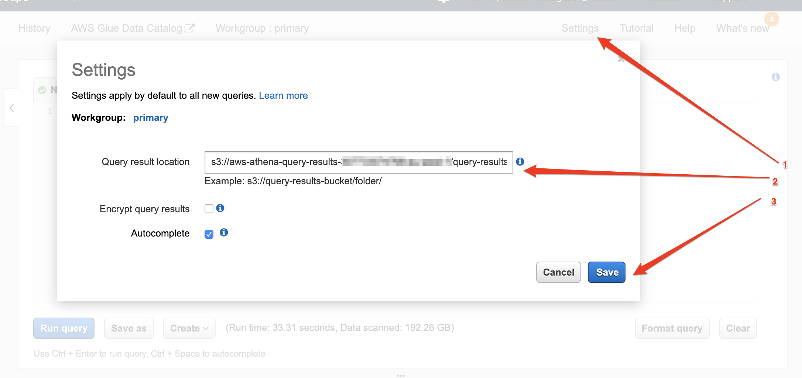
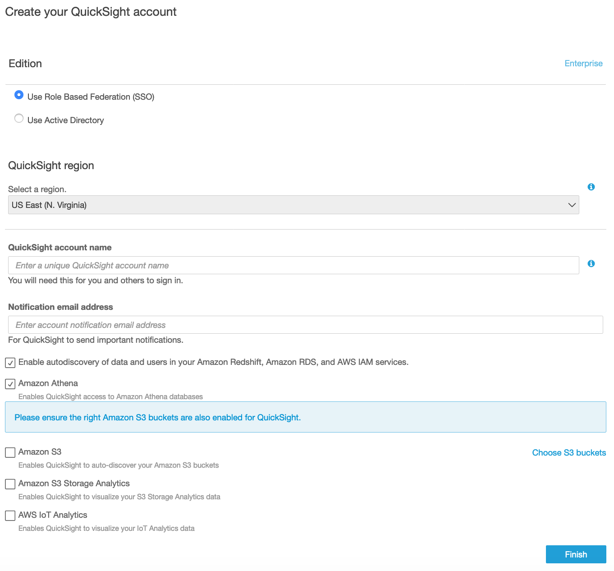
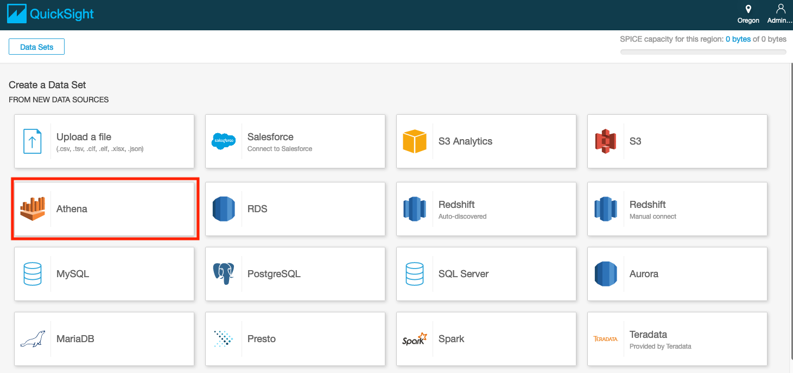
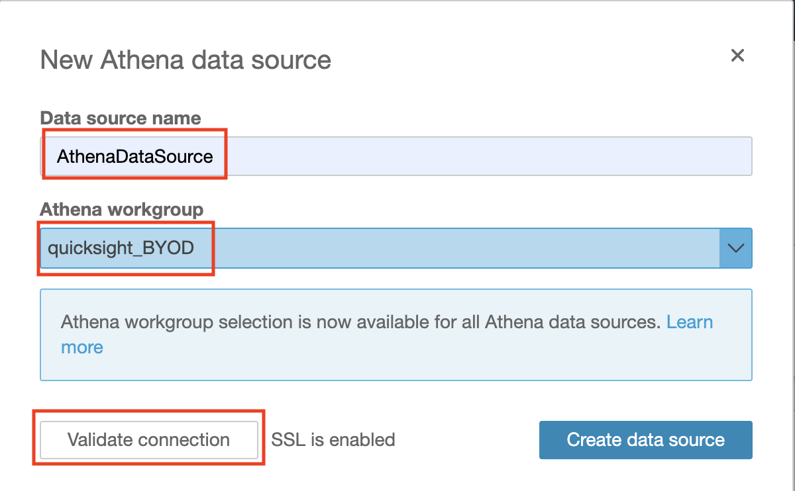
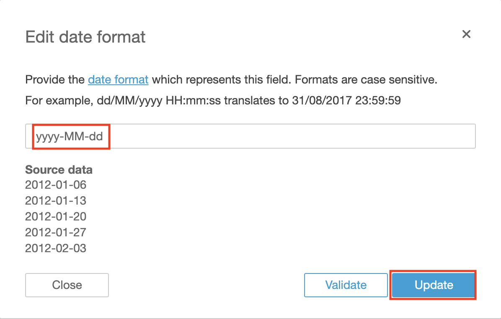
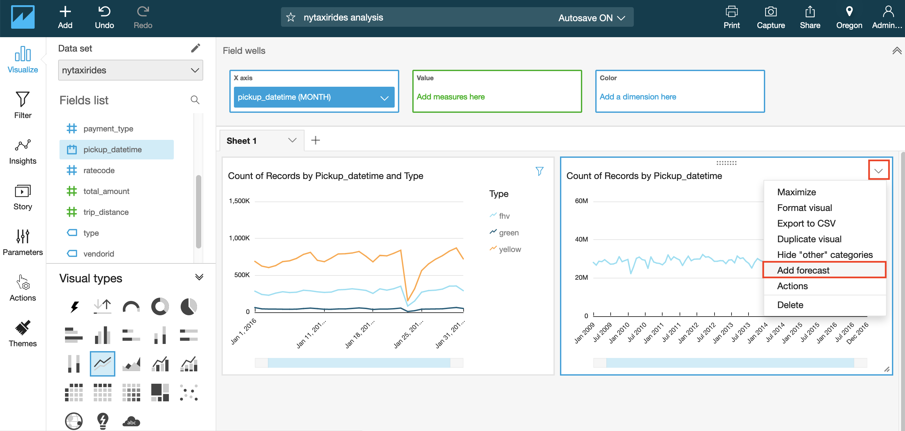
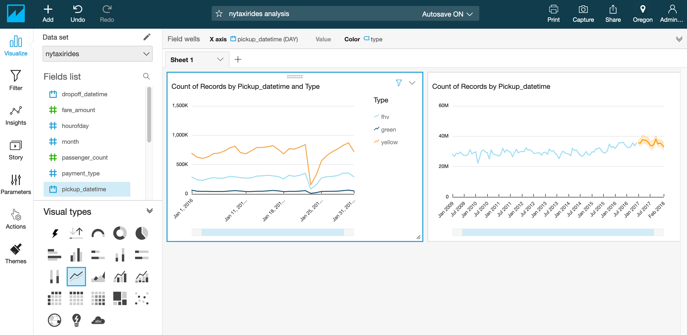
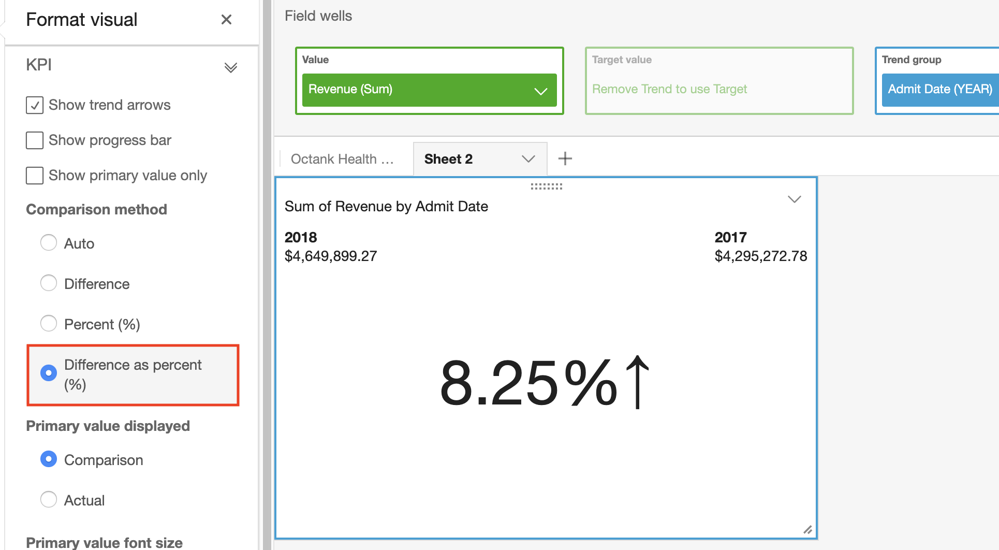

# Lab 2: Visualization using Amazon QuickSight

* [Create an Amazon S3 bucket](#create-an-amazon-s3-bucket)
* [Creating Amazon Athena Database and Table](#creating-amazon-athena-database-and-table)
    * [Create Athena Database](#create-database)
    * [Create Athena Table](#create-a-table)
* [Signing up for Amazon Quicksight Standard Edition](#signing-up-for-amazon-quicksight-standard-edition)
* [Configuring Amazon QuickSight to use Amazon Athena as data source](#configuring-amazon-quicksight-to-use-amazon-athena-as-data-source)
* [Visualizing the data using Amazon QuickSight](#visualizing-the-data-using-amazon-quicksight)
    * [Add year based filter to visualize the dataset for the year 2016](#add-year-based-filter-to-visualize-the-dataset-for-the-year-2016)
    * [Add the month based filter for the month of January](#add-the-month-based-filter-for-the-month-of-january)
    * [Visualize the data by hour of day for the month of January 2016](#visualize-the-data-by-hour-of-day-for-the-month-of-january-2016)
    * [Visualize the data for the month of January 2016 for all taxi types(yellow, green, fhv)](#visualize-the-data-for-the-month-of-january-2016-for-all-taxi-typesyellow-green-fhv)

    

## Architectural Diagram


## Create an Amazon S3 bucket
> Note: If you have already have an S3 bucket in your AWS Account you can skip this section. 

1. Open the [AWS Management console for Amazon S3](https://s3.console.aws.amazon.com/s3/home?region=us-west-2)
2. On the S3 Dashboard, Click on **Create Bucket**. 


3. In the **Create Bucket** pop-up page, input a unique **Bucket name**. It is advised to choose a large bucket name, with many random characters and numbers (no spaces). 

    1. Select the region as **Oregon**. 
    2. Click **Next** to navigate to next tab. 
    3. In the **Set properties** tab, leave all options as default. 
    4. In the **Set permissions** tag, leave all options as default.
    5. In the **Review** tab, click on **Create Bucket**


## Creating Amazon Athena Database and Table

> Note: If you have complete the [Lab 1: Serverless Analysis of data in Amazon S3 using Amazon Athena](../Lab1) you can skip this section and go to the next section [Signing up for Amazon Quicksight Standard Edition](#signing-up-for-amazon-quicksight-standard-edition)

Amazon Athena uses Apache Hive to define tables and create databases. Databases are a logical grouping of tables. When you create a database and table in Athena, you are simply describing the schema and location of the table data in Amazon S3\. In case of Hive, databases and tables don’t store the data along with the schema definition unlike traditional relational database systems. The data is read from Amazon S3 only when you query the table. The other benefit of using Hive is that the metastore found in Hive can be used in many other big data applications such as Spark, Hadoop, and Presto. With Athena catalog, you can now have Hive-compatible metastore in the cloud without the need for provisioning a Hadoop cluster or RDS instance. For guidance on databases and tables creation refer [Apache Hive documentation](https://cwiki.apache.org/confluence/display/Hive/LanguageManual+DDL). The following steps provides guidance specifically for Amazon Athena.

### Setting up Athena (first time users)

If you’re a first time Athena user, you might need to configure an S3 bucket, where Athena will store the query results.



You can use an already existing bucket with a dedicated folder or you can create a new, dedicated bucket.

<b>NOTE:</b> Make sure you have forward slash at the end of the S3 path

### Create Database

1. Open the [AWS Management Console for Athena](https://console.aws.amazon.com/athena/home).
2. If this is your first time visiting the AWS Management Console for Athena, you will get a Getting Started page. Choose **Get Started** to open the Query Editor. If this isn't your first time, the Athena **Query Editor** opens.
3. Make a note of the AWS region name, for example, for this lab you will need to choose the **US West (Oregon)** region.
4. In the Athena **Query Editor**, you will see a query pane with an example query. Now you can start entering your query in the query pane.
5. To create a database named *mydatabase*, copy the following statement, and then choose **Run Query**:

````sql
    CREATE DATABASE mydatabase
````

6.	Ensure *mydatabase* appears in the DATABASE list on the **Catalog** dashboard


### Create a Table

1. Ensure that current AWS region is **US West (Oregon)** region

2. Ensure **mydatabase** is selected from the DATABASE list and then choose **New Query**.

3. In the query pane, copy the following statement to create a the NYTaxiRides table, and then choose **Run Query**:

````sql
  CREATE EXTERNAL TABLE NYTaxiRides (
    vendorid STRING,
    pickup_datetime TIMESTAMP,
    dropoff_datetime TIMESTAMP,
    ratecode INT,
    passenger_count INT,
    trip_distance DOUBLE,
    fare_amount DOUBLE,
    total_amount DOUBLE,
    payment_type INT
    )
  PARTITIONED BY (YEAR INT, MONTH INT, TYPE string)
  STORED AS PARQUET
  LOCATION 's3://us-west-2.serverless-analytics/canonical/NY-Pub'
````

4.Ensure the table you just created appears on the Catalog dashboard for the selected database.

Now that you have created the table you need to add the partition metadata to the Amazon Athena Catalog.

1. Choose **New Query**, copy the following statement into the query pane, and then choose **Run Query** to add partition metadata.

```sql
    MSCK REPAIR TABLE NYTaxiRides
```
The returned result will contain information for the partitions that are added to NYTaxiRides for each taxi type (yellow, green, fhv) for every month for the year from 2009 to 2016

## Signing up for Amazon QuickSight Enterprise Edition

1. Open the [AWS Management Console for QuickSight](https://us-east-1.quicksight.aws.amazon.com/sn/start).


2. If this is the first time you are accessing QuickSight, you will see a sign-up landing page for QuickSight. 
3. Click on **Sign up for QuickSight**.

> **Note:** Chrome browser might timeout at this step. If that's the case, try this step in Firefox/Microsoft Edge/Safari.

4. On the next page, for the subscription type select the **"Enterprise Edition"** and click **Continue**. 


5. On the next page,

   i. Enter a unique **QuickSight account name.**

   ii. Enter a valid email for **Notification email address**.

   iii. Just for this step, leave the **QuickSight capacity region** as **N.Virginia**. 

   iv. Ensure that **Enable autodiscovery of your data and users in your Amazon Redshift, Amazon RDS and AWS IAM Services** and **Amazon Athena** boxes are checked. 

   v. **Click Finish**. 

   

   vi. You will be presented with a message **Congratulations**! **You are signed up for Amazon QuickSight!** on successful sign up. Click on **Go to Amazon QuickSight**. 

6. **Before continuing with the following steps, make sure you are in the N. Virginia Region to edit permissions.**

Now, on the Amazon QuickSight dashboard, navigate to User Settings page on the Top-Right section and click **Manage QuickSight**.

   

7. In this section, click on **Security & permissions** and then click **Add or remove**.

<p align="center"></p> 

8. Click on **Amazon S3** and on the tab that says **S3 buckets linked to QuickSight account**.
9. Ensure **Select All** is checked.
10. Click on **Select buckets**.


12. When you are done doing all this, click **Update** to bring you back to the user settings back.

## Configuring Amazon QuickSight to use Amazon Athena as data source

> For this lab, you will need to choose the region where your data resides. 


1. Click on the region icon on the top-right corner of the page, and select the region where your data resides. 

2. Click on **Manage data** on the top-right corner of the webpage to review existing data sets.


3. Click on **New data set** on the top-left corner of the webpage and review the options. 

4. Select **Athena** as a Data source.



5. Enter the **Data source** **name** (e.g. *AthenaDataSource*).

6. Select the Athena **workgroup** you created specifically for Quicksight. Then **Validate the Connection**.



7. Click **Create data source**.

8. Choose the table you need to visualize its data.

9. Choose **Save and Visualize** on top of the page.

***Alternative Option***

You can choose to create a dataset using S3 as your data source. For this:
* Make sure you have granted Amazon QuickSight access to any Amazon S3 buckets that you want to read files from.
* Create a manifest file to identify the text files that you want to import. [Supported Formats for Amazon S3 Manifest Files](https://docs.aws.amazon.com/quicksight/latest/user/supported-manifest-file-format.html)

## Preparing your data

1. You can edit an existing data set to perform data preparation. To edit a data set from the Your **Data Sets page**, choose the data set, and then choose **Edit Data Set**. The data set opens in the data preparation page.
*If you want to create a copy of the data set, choose **Duplicate** data set, and enter a name for the copy.*

2. Select the fields that you will use for the visualization.


We suggest that you pick two - three columns from your
data set that meet the following criteria:
*. The first column is a date column (can be year, month or day. Usually marked by **calendar icon**
in **Fields list** on the left)
*. The second column is a quantifiable number (revenue, count, distance, etc. Usually
marked by a **green hash #**)
*. The third column has categorical value, which means it has specific limited set of values (type,
category, etc. Usually marked by **ticket icon**)

3. Optional - Change the data type. You can change the field's data type in one of the available data types.

   
   You can also modify the format of your date field(s) into one of the supported formats.



## Visualizing the data using Amazon QuickSight

Now that you have configured the data source and prepared the dataset to work with, we will
start by forecasting values in future dates based on your sample data.

### Forecast Monthly Trend for your Quantity Column

2. Under the **Fields list**, Select your **Date** column for x-axis by clicking on the field name.
3. Change the visual type to a line chart by selecting the line chart icon highlighted in the screenshot below under **Visual types**.

At this point, the Y-axis of the visual will be populated automatically with count of records
that match each date individually. You can keep it that way and do forecasting for
**count of records**, or choose another **quantity attribute** from Fields list to populate
 Y-axis automatically and have more meaningful forecast.

Before viewing the forecast, you can choose the level of aggregation you want for your **date**
column to populate X-axis by year, month or day. 
4. Click on the **date** field name in top **Field Wells** bar to reveal a sub-menu.
5. Select **Aggregate:Month** to aggregate by month.

You can also use the slider on the X-axis to select the range of values to appear in the graph.


6. Click arrow in top right corner of the visual and select **Add forecast**.





**NOTE:** Make sure your Y-axis is assigned to a quantity column before proceeding.

### Adding Filters

You can apply filters to both regular and calculated fields, which include text, numeric, and date fields.
Let's apply a date filter:

1. Choose **Filter** on the tool bar.
2. On the **Applied filters** pane, choose **Create one**, and then choose a date field to filter on.


3. Choose in which visual the filter will apply and choose the filter type from the dropdown list.


4. Choose a comparison type.


5. Enter date values.


6. Choose Apply.

### Visualize Month over Month Quantity

1. Add a new visual by duplicating the previous visual. Click on visual top right arrow and select **Duplicate visual**.
2. Select **KPI** as the Visual Type (bottom left of the screen).
3. In the field wells, click arrow in **Date** column to change the aggregation level to Month or as needed.


1. Now select format visual by clicking on arrow on top right corner of the KPI graph.
2. Select **Different as percent(%)** under **comparison method** on the left.




### Review ML Insights

1. Click the ‘Insights’ menu on the left. Notice all the suggested insights QuickSight has generated based on what has been built so far!
2. Hover over any of the insights and click the ‘+’ to add it to the dashboard.


**NOTE:** You can customize the narrative by clicking on top right arrow of the visual and
selecting **Customize narrative**.

> Note: The interesting outlier in the above graph is that on Jan23rd, 2016, you see the dip in the number of taxis across all types. Doing a quick google search for that date, gets us this weather article from NBC New York
> 

*Using Amazon QuickSight, you were able to see patterns across a time-series data by building visualizations, performing ad-hoc analysis, and quickly generating insights.*

---
## License

This library is licensed under the Apache 2.0 License. 


