# Lab 4: Visualization using Amazon QuickSight

- [Lab 4: Visualization using Amazon QuickSight](#Lab-4-Visualization-using-Amazon-QuickSight)
  - [Architectural Diagram](#Architectural-Diagram)
  - [Signing up for Amazon QuickSight Enterprise Edition](#Signing-up-for-Amazon-QuickSight-Enterprise-Edition)
  - [Configuring Amazon QuickSight to use Amazon Athena as data source](#Configuring-Amazon-QuickSight-to-use-Amazon-Athena-as-data-source)
  - [Preparing your data](#Preparing-your-data)
  - [Visualizing the data using Amazon QuickSight](#Visualizing-the-data-using-Amazon-QuickSight)
    - [Forecast Monthly Trend for your Quantity Column](#Forecast-Monthly-Trend-for-your-Quantity-Column)
    - [Adding Filters](#Adding-Filters)
    - [Visualize Month over Month Quantity](#Visualize-Month-over-Month-Quantity)
    - [Review ML Insights](#Review-ML-Insights)
  - [License](#License)

## Architectural Diagram

In this lab you will be using the S3 bucket with your data and the Athena table you created in the previous lab.

## Signing up for Amazon QuickSight Enterprise Edition

1. Open the [AWS Management Console for QuickSight](https://us-east-1.quicksight.aws.amazon.com/sn/start).

2. If this is the first time you are accessing QuickSight, you will see a sign-up landing page for QuickSight. 
3. Click on **Sign up for QuickSight**.

> **Note:** Chrome browser might timeout at this step. If that's the case, try this step in Firefox/Microsoft Edge/Safari.

4. On the next page, for the subscription type select the **"Enterprise Edition"** and click **Continue**. 

5. On the next page,

   i. Enter a unique **QuickSight account name.**

   ii. Enter a valid email for **Notification email address**.

   iii. Just for this step, leave the **QuickSight capacity region** as **N.Virginia**. 

   iv. Ensure that **Enable autodiscovery of your data and users in your Amazon Redshift, Amazon RDS and AWS IAM Services** and **Amazon Athena** boxes are checked. 

   v. **Click Finish**. 

   

   vi. You will be presented with a message **Congratulations**! **You are signed up for Amazon QuickSight!** on successful sign up. Click on **Go to Amazon QuickSight**. 

6. **Before continuing with the following steps, make sure you are in the N. Virginia Region to edit permissions.**

Now, on the Amazon QuickSight dashboard, navigate to User Settings page by clicking on the Top-Right section - see image below - and click **Manage QuickSight**.

   

7. In this section, click on **Security & permissions** and then click **Add or remove**.

 

8. Click on **Amazon S3** and on the tab that says **S3 buckets linked to QuickSight account**.
9. You have two options depending on the permissions of your account:
  a. Choose **Select All** if you have permissions on all S3 folders
  b. Choose the following two buckets:
    i. The S3 bucket(s) you store your data
    ii. The S3 bucket that that you store Athena query results, as specified in your Athena workgroup settings.
  
10. Click on **Select buckets**.

12. When you are done doing all this, click **Update** to bring you back to the user settings back.

## Some Quicksight definitions

**What is a data source and what is a dataset?** 
A **data source** is an external data store and you use it to access the data in this external data store eg. Amazon S3, Amazon Athena, Salesforce etc.

A **data set** identifies the specific data in a data source that you want to use. For example, the data source might be a table if you are connecting to a database data source. It might be a file if you are connecting to an Amazon S3 data source. A data set also stores any data preparation you have performed on that data, such as renaming a field or changing its data type. Storing this preparation means that you don't have to reprepare the data each time you want to create an analysis based on it.

**What is an Analysis, a Visual and a Dashboard?** 
An **analysis** is a container for a set of related visuals and stories, for example all the ones that apply to a given business goal or key performance indicator. You can use multiple data sets in an analysis, although any given visual can only use one of those data sets.

A **visual** is a graphical representation of your data. You can create a wide variety of visuals in an analysis, using different datasets and visual types.

A **dashboard** is a read-only snapshot of an analysis that you can share with other Amazon QuickSight users for reporting purposes. A dashboard preserves the configuration of the analysis at the time you publish it, including such things as filtering, parameters, controls, and sort order. The data used for the analysis isn't captured as part of the dashboard. When you view the dashboard, it reflects the current data in the data sets used by the analysis.

## Configuring Amazon QuickSight to use Amazon Athena as data source

> For this lab, you will need to choose the region where your data resides. 

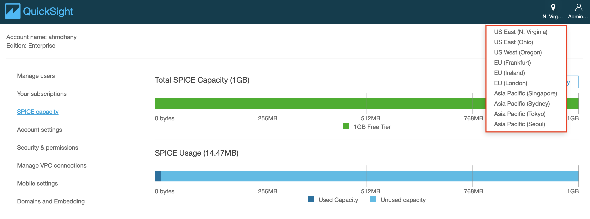

1. Click on the region icon on the top-right corner of the page, and select the region where your data resides. 

2. Click on **Manage data** on the top-right corner of the webpage to review existing data sets.

3. Click on **New data set** on the top-left corner of the webpage and review the options. 

4. Select **Athena** as a Data source.

5. Enter the **Data source** **name** (e.g. *AthenaDataSource*).

6. Select the Athena **workgroup** you created specifically for Quicksight. Then **Validate the Connection**.

7. Click **Create data source**.

8. Choose the table you need to visualize its data.

9. Choose **Save and Visualize** on top of the page.

***Alternative Option***

You can choose to create a dataset using S3 as your data source. For this:
* Make sure you have granted Amazon QuickSight access to any Amazon S3 buckets that you want to read files from.
* Create a manifest file to identify the text files that you want to import. [Supported Formats for Amazon S3 Manifest Files](https://docs.aws.amazon.com/quicksight/latest/user/supported-manifest-file-format.html)

## Preparing your data

1. You can edit an existing data set to perform data preparation. To edit a data set from the Your **Data Sets page**, choose the data set, and then choose **Edit Data Set**. The data set opens in the data preparation page.

  You can duplicate an existing data set to save a copy of it with a new name. The new data set is a completely separate copy.  Choose **Duplicate** data set, and enter a name for the copy.

2. Select the fields that you will use for the visualization.
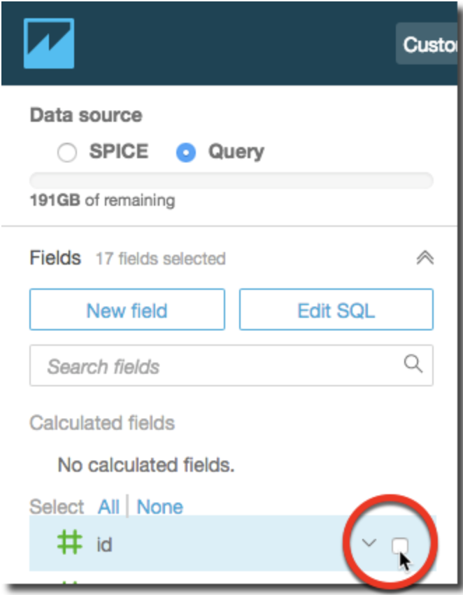

3. We suggest that you pick two - three columns from your data set that meet the following criteria:
  * The first column is a date column (can be year, month or day. Usually marked by **calendar icon**
in **Fields list** on the left)
  * The second column is a quantifiable number (revenue, count, distance, etc. Usually
marked by a **green hash #**)
  * The third column has categorical value, which means it has specific limited set of values (type,
category, etc. Usually marked by **ticket icon**)

4. Optional - Change the data type. You can change the field's data type in one of the available data types.
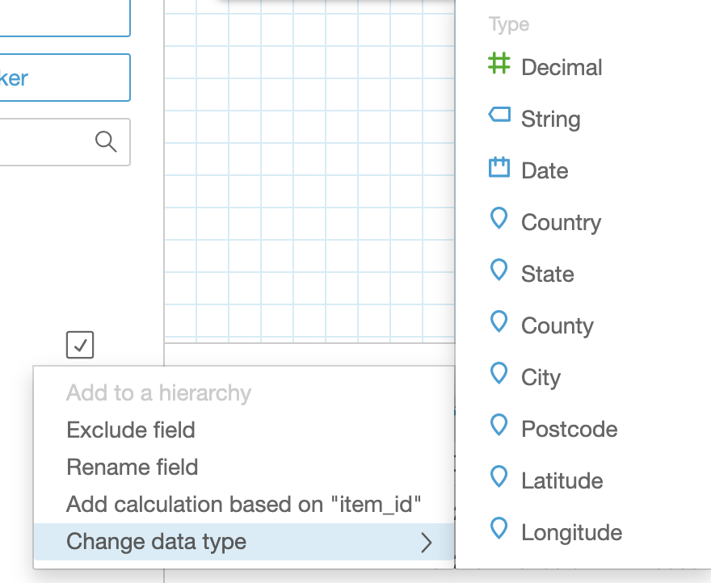
   
   You can also modify the format of your date field(s) into one of the supported formats.

## Visualizing the data using Amazon QuickSight

Now that you have configured the data source and prepared the dataset to work with, we will
start by forecasting values in future dates based on your sample data.

### Forecast Monthly Trend for your Quantity Column

2. Under the **Fields list**, Select your **Date** column for x-axis by clicking on the field name.
3. Change the visual type to a line chart by selecting the line chart icon highlighted in the screenshot below under **Visual types**.

At this point, the Y-axis of the visual will be populated automatically with count of records
that match each date individually. You can keep it that way and do forecasting for
**count of records**, or choose another **quantity attribute** from Fields list to populate
 Y-axis automatically and have more meaningful forecast.

Before viewing the forecast, you can choose the level of aggregation you want for your **date**
column to populate X-axis by year, month or day. 
4. Click on the **date** field name in top **Field Wells** bar to reveal a sub-menu.
5. Select **Aggregate:Month** to aggregate by month.

You can also use the slider on the X-axis to select the range of values to appear in the graph.

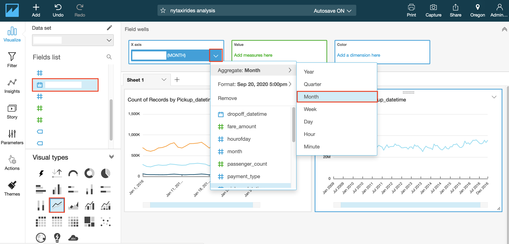

6. Click arrow in top right corner of the visual and select **Add forecast**.

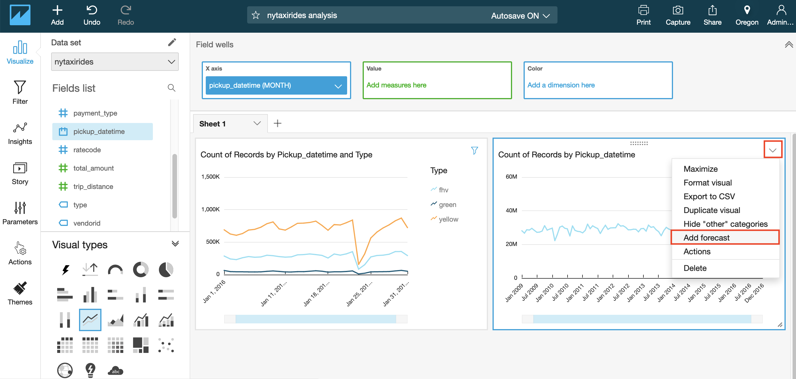

**NOTE:** Make sure your Y-axis is assigned to a quantity column before proceeding.

### Adding Filters

You can apply filters to both regular and calculated fields, which include text, numeric, and date fields.
Let's apply a date filter:

1. Choose **Filter** on the tool bar.
2. On the **Applied filters** pane, choose **Create one**, and then choose a date field to filter on.
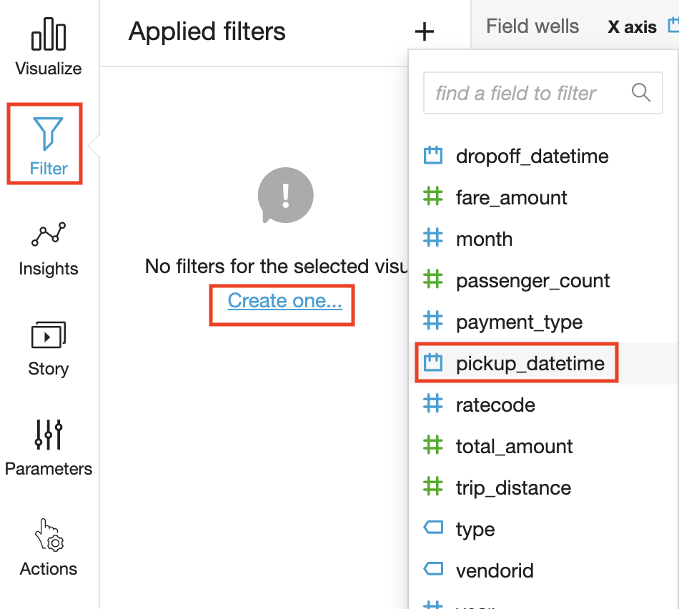

3. Choose in which visual the filter will apply and choose the filter type from the dropdown list.
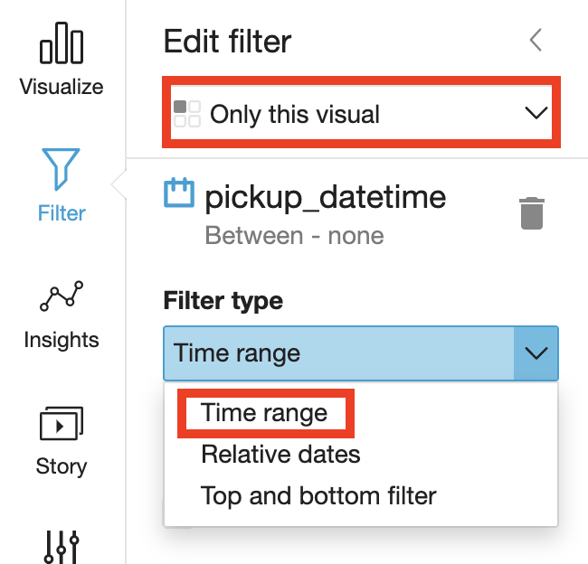

4. Choose a comparison type.

5. Enter date values.
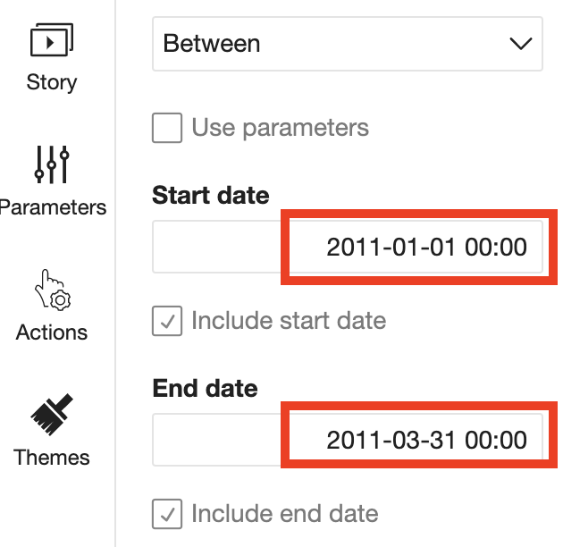

6. Choose Apply.

### Visualize Month over Month Quantity

1. Add a new visual by duplicating the previous visual. Click on visual top right arrow and select **Duplicate visual**.
2. Select **KPI** as the Visual Type (bottom left of the screen).
3. In the field wells, click arrow in **Date** column to change the aggregation level to Month or as needed.

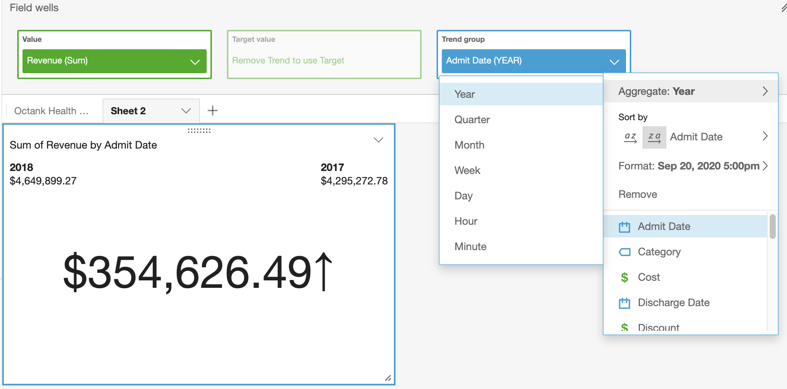

1. Now select format visual by clicking on arrow on top right corner of the KPI graph.
2. Select **Different as percent(%)** under **comparison method** on the left.

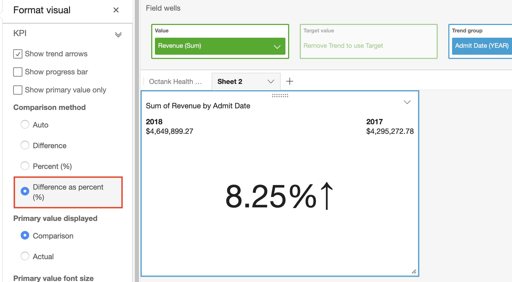

### Review ML Insights

1. Click the ‘Insights’ menu on the left. Notice all the suggested insights QuickSight has generated based on what has been built so far!
2. Hover over any of the insights and click the ‘+’ to add it to the dashboard.

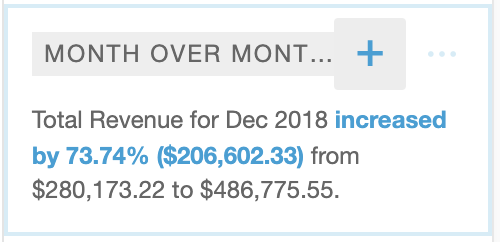

**NOTE:** You can customize the narrative by clicking on top right arrow of the visual and
selecting **Customize narrative**.

> Note: The interesting outlier in the above graph is that on Jan23rd, 2016, you see the dip in the number of taxis across all types. Doing a quick google search for that date, gets us this weather article from NBC New York
> 

*Using Amazon QuickSight, you were able to see patterns across a time-series data by building visualizations, performing ad-hoc analysis, and quickly generating insights.*

---
## License

This library is licensed under the Apache 2.0 License. 

Now go to lab 5 : [Transformation](../05_transformations/transformation.md)

