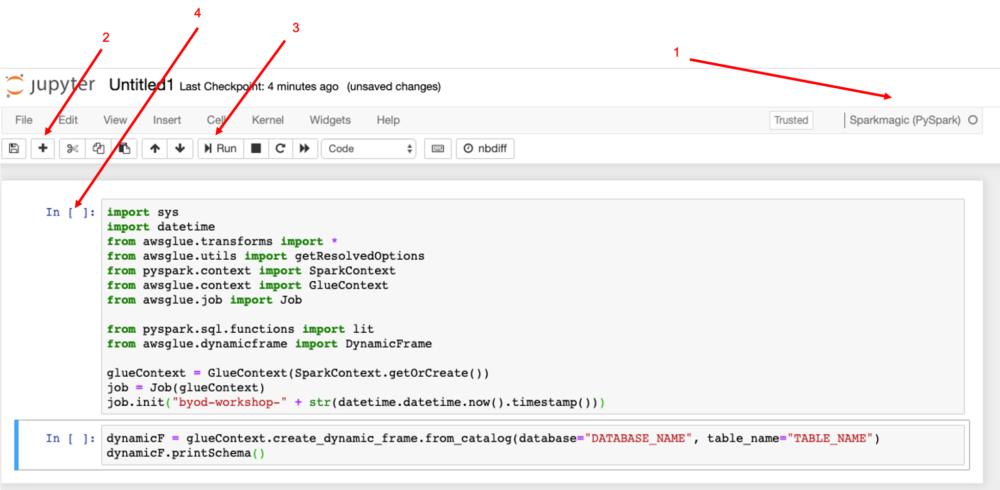
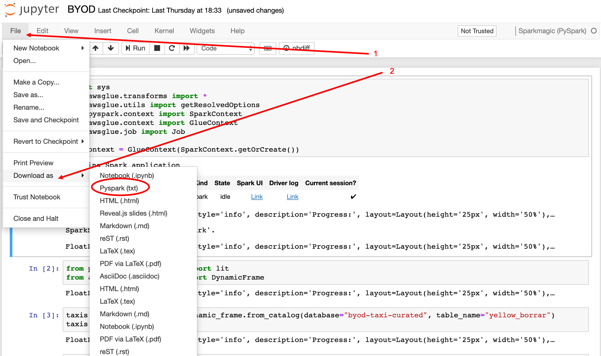

[0-Prerequisites](../00_Prerequisites/README.md) > [1-Ingestion](../01_ingestion_with_glue/README.md) > [2-Orchestration](../02_orchestration/README.md) > [3-Interactive-SQL](../03_interactive_sql_queries/README.md) > [4-Visualisation](../04_visualization_and_reporting/README.md) > 5-Transformations

# Lab 05 - Transformations

- [Lab 05 - Transformations](#Lab-05---Transformations)
  - [Open the notebook](#Open-the-notebook)
  - [Transformations](#Transformations)
    - [Drop Columns](#Drop-Columns)
      - [Example NY Taxis dataset](#Example-NY-Taxis-dataset)
    - [Convert to Time stamp](#Convert-to-Time-stamp)
      - [Example NY Taxis dataset](#Example-NY-Taxis-dataset-1)
  - [Partitioning](#Partitioning)
  - [Run this in a Glue Job](#Run-this-in-a-Glue-Job)
- [Terminate the following resources](#Terminate-the-following-resources)


Now we are going to start cleaning, transforming, aggregating and partitioning data. For development and debugging purposes, we are going to use the Developer Endpoint and Notebook we created some steps back.

## Open the notebook

Click in the Notebooks and Open the Notebook created. This will launch Jupyter Notebook. Go to New -> Sparkmagic (PySpark)

It should open a brand new notebook, we will be adding and running line by line of code, this will make it easier to understand the step by step and find errors faster. It should look something like this



1. Make sure that the notebook is running pyspark
2. This is the plus button for adding new lines - In this image I have added two lines of code
3. Once you add a line of code, then click Run
4. Once it has run, then you should see a number here

Click plus [2] - We will start by importing all the libraries we need 

``` python
import sys
import datetime
from awsglue.transforms import *
from awsglue.utils import getResolvedOptions
from pyspark.context import SparkContext
from awsglue.context import GlueContext
from awsglue.job import Job

from pyspark.sql.functions import lit
from awsglue.dynamicframe import DynamicFrame

glueContext = GlueContext(SparkContext.getOrCreate())
job = Job(glueContext)
job.init("byod-workshop-" + str(datetime.datetime.now().timestamp()))

```
Then click Run

**Dynamic Frame vs Spark/ Data frames**
One of the major abstractions in Apache Spark is the SparkSQL DataFrame, which is similar to the DataFrame construct found in R and Pandas. A DataFrame is similar to a table and supports functional-style (map/reduce/filter/etc.) operations and SQL operations (select, project, aggregate).

DataFrames are powerful and widely used, but they have limitations with respect to extract, transform, and load (ETL) operations. Most significantly, they require a schema to be specified before any data is loaded. To address these limitations, AWS Glue introduces the DynamicFrame. A DynamicFrame is similar to a DataFrame, except that each record is self-describing, so no schema is required initially. Instead, AWS Glue computes a schema on-the-fly when required, and explicitly encodes schema inconsistencies using a choice (or union) type.

We are going to use the data we transformed to parquet in previous steps. For that, we create a dynamic frame pointing to the database and table that our crawler inferred, then we are going to show the schema

If you do not remember the database/table names, just go to Databases/ Table tab in Glue and copy its names.

Click plus [2] and add the following code in a separate line

``` python
dynamicF = glueContext.create_dynamic_frame.from_catalog(database="DATABASE_NAME", table_name="TABLE_NAME")
dynamicF.printSchema()
```
Then click Run

## Transformations

You probably have a large number of columns and some of them can have complicated names. To analyze the data, perhaps we may not need all the columns, just a small set of them, and to make easier to recall, we may want to change the name of the columns. Therefore, we are going to select only the columns we are interested in, drop the rest of them and we are going to rename them.

### Drop Columns

There is two different ways to drop columns

1. You use the select_fields class to drop all the columns and keep just the ones you need

``` python
dynamicF= dynamicF.select_fields(['COLUMN1_TO_KEEP','COLUMN2_TO_KEEP']).rename_field('COLUMN1_TO_KEEP/RENAME', 'NEW_COLUMN_NAME').rename_field('COLUMN2_TO_RENAME', 'NEW_COLUMN_NAME')
dynamicF.printSchema()
```

2. You use the drop_fields class to keep all the columns and just drop the ones you do not need. 

``` python
dynamicF = dynamicF.drop_fields(['COLUMN1_TO_DROP','COLUMN2_TO_DROP']).rename_field('COLUMN1_TO_KEEP/RENAME', 'NEW_COLUMN_NAME').rename_field('COLUMN2_TO_RENAME', 'NEW_COLUMN_NAME')
dynamicF.printSchema()
```

For the rename part, we are using the rename_fields class. This should be invoked for each column you want to rename


#### Example NY Taxis dataset

``` python
dynamicF = dynamicF.select_fields(['tpep_pickup_datetime','trip_distance']).rename_field('tpep_pickup_datetime', 'pickup_datetime')
dynamicF.printSchema()
```

### Convert to Time stamp

Please check the datetime column schema, from the previous step. It may be string or another type different than what we may need it to be. Therefore, we are going to do some transformations.

First, let's add the libraries we need to make this conversion:

``` python 
from pyspark.sql.functions import date_format
from pyspark.sql.functions import to_date
from pyspark.sql.types import DateType
from pyspark.sql.functions import year, month, dayofmonth, date_format, cast
```
Then, depending on the format of our current field, we may want to convert it into another format that contains year and month only. This will allow us later to partition our data according to year and month easily. Select which line of code you will use according to your date type format.

First, we need to change the format from dynamic frame to dataframe (If you do not remember the difference between dynamic frame and data frame, you can read again the explanation above). This will allow us to use some the libraries previously imported:


``` python 
df = dynamicF.toDF()
df.show()
```


**ISO 8601 TIMESTAMP**
Below is example code that can be used to do the conversion from ISO 8601 date format. Please substitute your own date-format in place of yyyy-MM-dd

``` python 
## Adding trx_date date column with y-M format converting a current timestamp/unix date format
df = df.withColumn('trx_date', date_format(df['{YOUR_DATE_COL_NAME}'], "yyyy-MM-dd").cast(DateType()))
```

If you do not get an error but the date column is full of NULL, then probably you didn't substitute your own date-format in yyyy-MM-dd
If you still have errors, then please go to the other date formats section.

#### Example NY Taxis dataset

``` python 
## Adding trx_date date column with yyyy-MM-dd format converting a current timestamp/unix date format
df = df.withColumn('pickup_datetime', to_date("pickup_datetime", "yyyy-MM-dd"))
df.show()
```

## Partitioning

Partitioning the data greatly increases the performance of your queries and reduce costs. For example, if you only need last month's data from a large dataset, if the data is partitioned by day, month and year, then you can use a "where" clause in your query and Athena will only use relevant folders and will not scan the unnecessary ones.

In order to partition our data, we will first create extra columns for year, month and day. Then when writing the data into S3, we will partition it by year, month and day. So, our final folder structure will be like:

```
/curated/TABLE-NAME-1/year=YYYY/month=MM/day=DD/file1.parquet
```

You can also add additional partitions if you know you will often use those fields to filter data. For example, if you will often filter your data on product types, you can add a column for that field and also partition by that column additionally.

Add this code at the end of your script:
```python
df_partition = dynamicF.toDF()
df_partition = df_partition.withColumn('trx_date', date_format("YOUR-DATE-FIELD", "yyyy-MM-dd").cast(DateType()))

df_partition = df_partition.withColumn('year', year(df.trx_date)).withColumn('month', month(df.trx_date)).withColumn('day', dayofmonth(df.trx_date))

df_partition.show()

```

See that there are three extra fields for year, month and day.

## Run this in a Glue Job


Please add these lines to the end of your notebook 

``` python
## DONT FORGET TO PUT IN YOUR BUCKET NAME.
output_location = "s3://YOUR-BUCKET/curated"

df_partition.write.mode("overwrite").partitionBy("year","month","day").parquet(output_location)

job.commit()
```

Now, let's export our job and move it into a glue job.



1. Click File
2. Download as > Pyspark (txt)

Please open the txt file, **Remove any line containing**:
```python
.show()
.printSchema()
```
and copy it. In the AWS Glue Console (https://console.aws.amazon.com/glue/), click on **Jobs**, and **Add Job**

- Name:  `byod-data-transformation`
- IAM Role: glue-processor-role
- This job runs: A new script to be authored by you
- Monitoring - Job metrics
- Connections - Save job and edit script
- Now, paste the txt downloaded from the notebook
- Save and Run

## Others time formats

Now, depending on the time format, please select which line of code you will use according to your date type format.

**UNIX TIMESTAMP**

``` python
## Adding trx_date date column with yyyy-MM-dd format converting a current timestamp/unix date format
df = df.withColumn('trx_date', date_format(from_unixtime(df['{YOUR_DATE_COL_NAME}']), "yyyy-MM-dd").cast(DateType()))
```

**OTHER DATE FORMATS**

To convert unique data formats, we use to_date() function to specify how to parse your value specifying date literals in second attribute (Look at resources section for more information).

``` python
## Adding trx_date date column with yyyy-MM-dd format converting a current timestamp/unix date format
df = df.withColumn('trx_date', date_format(to_date(df['{YOUR_DATE_COL_NAME}'], {DATE_LITERALS}), "yyyy-MM-dd").cast(DateType()))
```

## Terminate the following resources

The Glue development endpoint and the notebook will incur charges. So please go to [Glue](https://console.aws.amazon.com/glue/home?region=us-east-1#etl:tab=devEndpoints)
Select the endpoint - Action -> Delete

Then go to the [notebook](https://console.aws.amazon.com/glue/home?region=us-east-1#etl:tab=notebooks)
Select the notebook - Action -> Stop, then Delete


