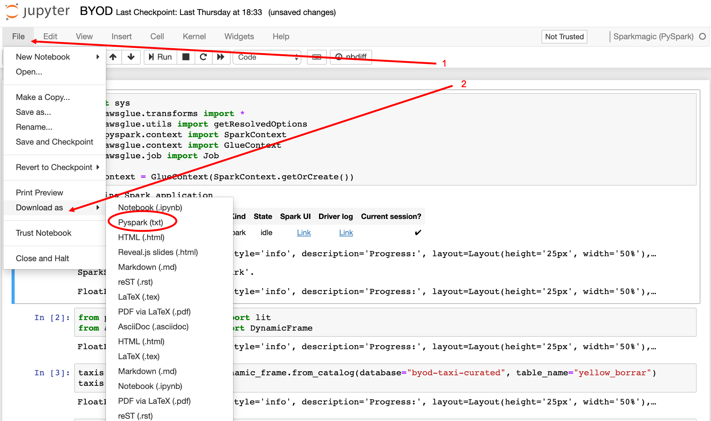

# Playing with the data


Now we are going to start cleaning, transforming, aggregating and partitioning data. For development and debugging purposes, we are going to use the Developer Endpoint and Notebook we created some steps back.

## Open the notebook

Click in the Notebooks and Open the Notebook created. This will launch Jupyter Notebook. Go to New -> Sparkmagic (PySpark)

We will start by importing all the libraries we need 

``` python
import sys
import datetime
from awsglue.transforms import *
from awsglue.utils import getResolvedOptions
from pyspark.context import SparkContext
from awsglue.context import GlueContext
from awsglue.job import Job

from pyspark.sql.functions import lit
from awsglue.dynamicframe import DynamicFrame

glueContext = GlueContext(SparkContext.getOrCreate())
job = Job(glueContext)
job.init("byod-workshop-" + str(datetime.datetime.now().timestamp()))

```

We are going to use the data we transformed to parquet in previous steps. For that, we create a dynamic frame pointing to the database and table that our crawler inferred, then we are going to show the schema.

If you dont remember the database/ table names, just go to Databases/ Table tab in Glue and copy its names.

``` python
dynamicF = glueContext.create_dynamic_frame.from_catalog(database="DATABASE_NAME", table_name="TABLE_NAME")
dynamicF.printSchema()
```

## Transformations

You probably have a large number of columns and some of them can have complicated names. To analyze the data, perphaps we may not need all the columns, just a small set of them, and to make easier to recall, we may want to change the name of the columns. Therefore, we are going to select only the columns we are interested in, drop the rest of them and we are going to rename them.

### Drop Columns


``` python
dynamicF = dynamicF.select_fields(['COLUMN1_TO_KEEP/RENAME','COLUMN2_TO_KEEP']).rename_field('COLUMN1_TO_KEEP/RENAME', 'NEW_COLUMN_NAME')
dynamicF.printSchema()
```

#### Example NY Taxis dataset

``` python
dynamicF = dynamicF.select_fields(['tpep_pickup_datetime','trip_distance']).rename_field('tpep_pickup_datetime', 'pickup_datetime')
dynamicF.printSchema()
```


### Convert to Time stamp

Please check the datetime column schema, from the previous step. It may be string or another type different than what we may need it to be. Therefore, we are going to do some transformations.

First, lets add the libraries we need to make this conversion:

``` python 
from pyspark.sql.functions import date_format
from pyspark.sql.functions import to_date
from pyspark.sql.types import DateType
```
Then, depending on the format of our current field, we may want to convert it into another format that contains year and month only. This will allow us later to partition our data according to year and month easily. Select which line of code you will use according to your date type format.

First, we need to change the format from dynamic frame to dataframe. This will allow us to use some the libraries previously imported:


``` python 
df = dynamicF.toDF()
df.show()
```

Now, depending on the time format, please select which line of code you will use according to your date type format.

**ISO 8601 TIMESTAMP**
Below is example code that can be used to do the conversion from ISO 8601 date format.

``` python 
## Adding trx_date date column with y-M format converting a current timestamp/unix date format
df = df.withColumn('trx_date', date_format(df['{YOUR_DATE_COL_NAME}'], "yyyy-MM-dd").cast(DateType()))
```

**UNIX TIMESTAMP**

``` python
## Adding trx_date date column with yyyy-MM-dd format converting a current timestamp/unix date format
df = df.withColumn('trx_date', date_format(from_unixtime(df['{YOUR_DATE_COL_NAME}']), "yyyy-MM-dd").cast(DateType()))
```

**OTHER DATE FORMATS**

To convert unique data formats, we use to_date() function to specify how to parse your value specifying date literals in second attribute (Look at resources section for more information).

``` python
## Adding trx_date date column with yyyy-MM-dd format converting a current timestamp/unix date format
df = df.withColumn('trx_date', date_format(to_date(df['{YOUR_DATE_COL_NAME}'], {DATE_LITERALS}), "yyyy-MM-dd").cast(DateType()))
```

#### Example NY Taxis dataset

``` python 
## Adding trx_date date column with yyyy-MM-dd format converting a current timestamp/unix date format
df = dynamicF.toDF()
df = df.withColumn('pickup_datetime', to_date("pickup_datetime", "yyyy-MM-dd"))
df.show()
```

## Partitioning

Partitioning the data greatly increases the performance of your queries and reduce costs. For example, if you only need last month's data from a large dataset, if the data is partitioned by day, month and year, then you can use a "where" clause in your query and Athena will only use relevant folders and will not scan the unnecessary ones.

In order to partition our data, we will first create extra columns for year, month and day. Then when writing the data into S3, we will partition it by year, month and day. So, our final folder structure will be like:

```
/curated/TABLE-NAME-1/year=YYYY/month=MM/day=DD/file1.parquet
```

You can also add additional partitions if you know you will often use those fields to filter data. For example if you will often filter your data on product types, you can add a column for that field and also partition by that column additionally.

Add this code at the end of your script:
```python
df = df.withColumn('trx_date', date_format("YOUR-DATE-FIELD", "yyyy-MM-dd").cast(DateType()))

df = df.withColumn('year', year(df.trx_date)).withColumn('month', month(df.trx_date)).withColumn('day', dayofmonth(df.trx_date))

df.show()

```

See that there are three extra fields for year, month and day.

## Run this in a Glue Job


Please add this lines to the end of your notebook 

``` python
## DONT FORGET TO PUT IN YOUR BUCKET NAME.
output_location = "s3://YOUR-BUCKET/curated"

df.write.mode("overwrite").partitionBy("year","month","day").parquet(output_location)

job.commit()
```

Now, lets export our job and move it into a glue job.



1. Click File
2. Download as > Pyspark (txt)

Please open the txt file, **Remove any line containing**:
```python
.show()
.printSchema()
```
and copy it. In the AWS Glue Console (https://console.aws.amazon.com/glue/), click on **Jobs**, and **Add Job**

- Name:  `byod-data-transformation`
- IAM Role: glue-processor-role
- This job runs: A new script to be authored by you
- Monitoring - Job metrics
- Connections - Save job and edit script
- Now, paste the txt downloaded from the notebook
- Save and Run


